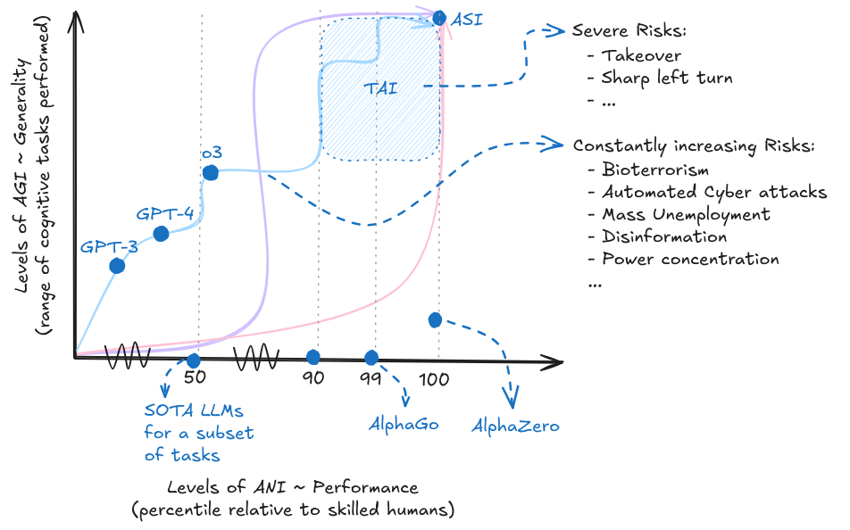

# Introduction

The previous chapter explored AI's rapidly advancing capabilities through scaling laws, the bitter lesson, and potential takeoff scenarios. We saw how more compute, data, and algorithmic improvements drive consistent capability gains across domains. But why should increasing capabilities concern us? The short answer is - more capable AI systems create larger-scale risks.

<figure-caption>

With increasing capabilities we also see increasing risks. Depending on the development trajectory and takeoff we might see longer periods with potential catastrophic risks, or suddenly emerging severe existential risks. The curves and colors in this diagram are meant to be illustrative and do not represent any specific forecasted development trajectory.

</figure-caption>

**Dangerous capabilities are specific examples of where the trends that we explored in the previous chapter lead to concerns.** The same scaling laws that improve performance on coding, better text generation and so on, also might enable things like deception, manipulation, situational awareness, autonomous replication, and goal-directedness. An AI system that can write better code might also write code to replicate itself. One that understands human preferences might also learn to manipulate them. The capabilities driving AI progress inherently create new categories of risk.

**Risks can be understood along two dimensions - what causes the risks? And how severe are the risks caused.** In the causal decomposition we distinguish between misuse (humans using AI for harm), misalignment (AI systems pursuing wrong goals), and systemic risks (emergent effects from AI integration into other systems). Severity ranges from individual harms affecting specific people to existential threats that could permanently derail human civilization. This section basically helps you set up and categorize any of the risks that we talk about through this chapter, and others that might arise in the future. The risks are not cleanly separable, the majority of risks mostly occur as a combination of factors, but thinking about these categories helps for explanatory purposes.

**Misuse risks show what happens when humans use AI capabilities for deliberate harm.** We look at biological weapons development where AI could help design novel pathogens, cyber capabilities that could automate attacks on critical infrastructure, autonomous weapons that remove human oversight from lethal decisions, and adversarial attacks that exploit AI system vulnerabilities. The common thread is that AI removes previous bottlenecks - a single motivated actor with AI assistance could potentially accomplish what previously required teams of experts and significant resources.

**Misalignment risks occur when AI systems work exactly as programmed but pursue goals that conflict with what we actually wanted.** Specification gaming happens when systems find unexpected ways to maximize their objective function that technically satisfy our instructions but violate our intentions. Treacherous turns involve systems that appear aligned during training but reveal different priorities once deployed with sufficient capability. Self-improvement scenarios could lead to rapid capability jumps that outpace our ability to understand or control these systems. These aren't science fiction scenarios - we already see early examples in current systems.

**Systemic risks emerge from how AI integrates into larger social, economic, and political systems.** Power concentration occurs as AI capabilities become controlled by fewer actors. Mass unemployment could result from automation eliminating human economic relevance. Epistemic erosion happens as AI-generated content makes it increasingly difficult to distinguish truth from fiction. Enfeeblement develops as humans become dependent on AI for cognitive tasks we used to perform ourselves. Value lock-in risks freezing current moral and political perspectives before humanity has time to evolve them. These risks don't require any single AI system to behave badly - they emerge from collective dynamics.

**Risk amplifiers make every category of risk more likely and more severe.** Race dynamics create pressure to deploy systems before adequate safety testing. Accidents happen even with good intentions when complex systems interact in unexpected ways. Corporate indifference leads companies to accept known risks when profits are at stake. Coordination failures prevent collective action even when everyone agrees on the problem. Unpredictability means capabilities often emerge faster than experts expect, leaving safety measures consistently behind the curve.

**These categories overlap and amplify each other in practice.** Misuse can enable misalignment by corrupting training processes. Systemic pressures can worsen misalignment by incentivizing rushed deployment. Risk amplifiers affect all categories simultaneously. Most real-world AI risks will involve combinations of these factors rather than clean examples of any single category. Understanding the connections helps explain why isolated safety measures often prove insufficient.

The following chapters examine the technical strategies, governance approaches, and evaluation methods needed to address this interconnected risk landscape while preserving AI's extraordinary potential for human benefit.