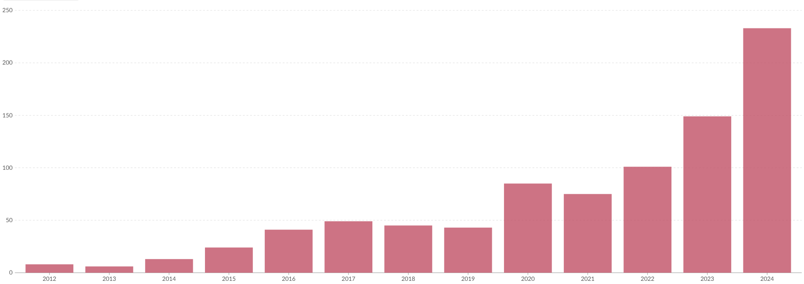
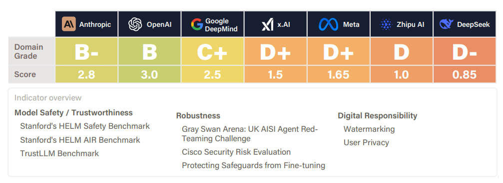
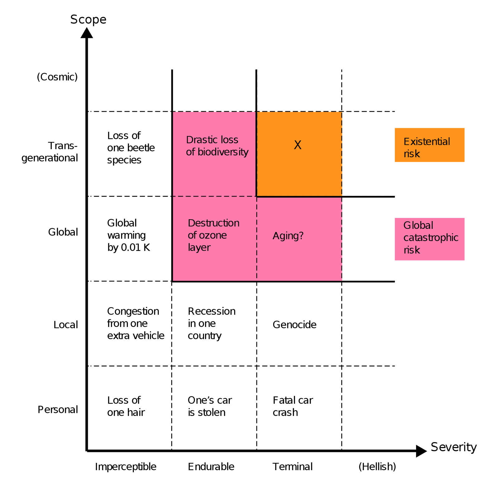
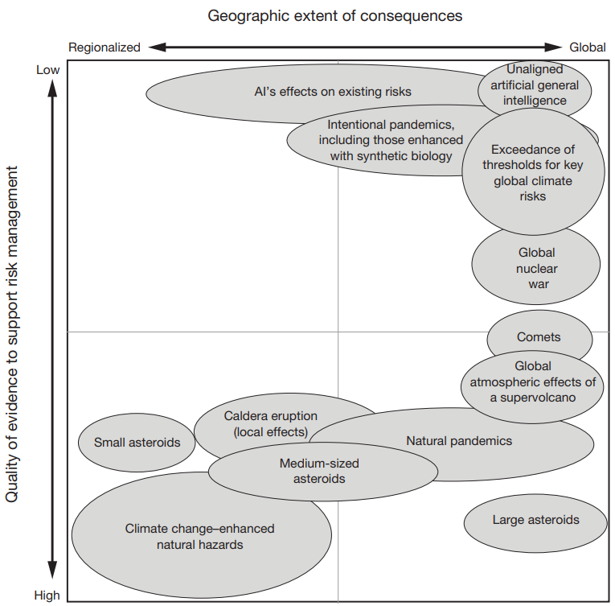
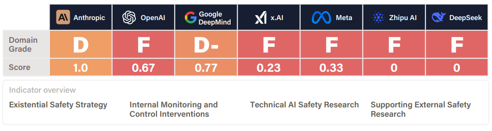

# Risk Decomposition

Before we begin talking about concrete risk scenarios we need a framework that allows us to evaluate where along the risk spectrum they lie. Risk classification is inherently multi-dimensional rather than seeking a single "best" categorization. We have chosen to break risks down into two factors - "why risks occur" (cause) and “how bad can the risks get” (severity). Other complementary frameworks like MIT's risk taxonomy approaches like "who causes them" (humans vs. AI systems), "when they emerge" (development vs. deployment), or "whether outcomes are intended" ([Slattery et al., 2024](https://arxiv.org/abs/2408.12622)). Our decomposition approach is just one out of many possible outlooks, but the risks we will talk about tend to be common throughout.

## Causes of Risk

**We categorize AI risks by causal responsibility to understand intervention points.** We divide risks based on who or what bears primary responsibility: humans using AI as a tool (misuse), AI systems themselves behaving unexpectedly (misalignment), or emergent effects from complex system interactions (systemic). This causal outlook helps identify where interventions might be most effective.

- **Misuse risks occur when humans intentionally deploy AI systems to cause harm.** These include malicious actors, nation states, corporations, or individuals who leverage AI capabilities to accelerate existing threats or create new ones. The AI system may function exactly as designed, but human intent creates the risk. Examples range from using AI to generate malware or bioweapons to deploying autonomous weapons or conducting large-scale disinformation campaigns.

- **Misalignment risks emerge when AI systems pursue goals different from human intentions.** These risks stem from technical challenges in specifying objectives, training processes that create unexpected behaviors, or AI systems learning goals that conflict with human values. Unlike misuse, these risks occur despite good human intentions - the AI system itself generates the harmful behavior through specification gaming, goal misgeneralization, or other alignment failures.

- **Systemic risks arise from AI integration with complex global systems, creating emergent threats no single actor intended.** These include power concentration as AI capabilities become monopolized, mass unemployment from automation, epistemic erosion as AI-generated content floods information systems, and cascading failures across interconnected infrastructure. Responsibility becomes diffuse across many actors and systems, making traditional accountability frameworks inadequate.

**Many real-world AI risks combine multiple causal pathways or resist clear categorization entirely.** Analysis of over 1,600 documented AI risks reveals that many don't fit cleanly into any single category ([Slattery et al., 2024](https://arxiv.org/abs/2408.12622)). Risks involving human-AI interaction blend individual misalignment with systemic risks. Multi-agent risks emerge from AI systems interacting in unexpected ways. Some scenarios involve cascading effects where misuse enables misalignment, or where systemic pressures amplify individual failures. We have chosen the causal decomposition for explanatory purposes, but it is worth keeping in mind that there will be overlap, and the future will likely contain a mix of risks from various causes.

## Severity of Risk

**AI risks span a spectrum from individual harms to threats that could permanently derail human civilization.** Understanding severity helps prioritize limited resources and calibrate our response to different types of risks. Rather than treating all AI risks as equally important, we can organize them by scope and severity to understand which demand immediate attention versus longer-term preparation.

**Individual and local risks affect specific people or communities but remain contained in scope.** The AI Incident Database documents over 1,000 real-world instances where AI systems have caused or nearly caused harm ([McGregor, 2020](https://arxiv.org/abs/2011.08512); [AI Incident Database, 2025](https://incidentdatabase.ai/)). These include things like autonomous car crashes, algorithmic bias in hiring or lending that disadvantages particular individuals, privacy violations from AI systems that leak personal data, or manipulation through targeted misinformation campaigns. Local risks might involve AI system failures that disrupt a city's traffic management or cause power outages in a region. These risks are already causing immediate, documented harm to anywhere from thousands to hundreds of thousands of people.

<iframe-static-figure>

</iframe-static-figure>

<iframe src="https://ourworldindata.org/grapher/annual-reported-ai-incidents-controversies?tab=chart" loading="lazy" style="width: 100%; height: 600px; border: 0px none;" allow="web-share; clipboard-write"></iframe>

<iframe-caption>

Global annual number of reported artificial intelligence incidents and controversies. Notable incidents include a “deepfake” video of Ukrainian President Volodymyr Zelenskyy surrendering, and U.S. prisons using AI to monitor their inmates’ calls. ([Giattino et al., 2023](https://ourworldindata.org/artificial-intelligence)).

</iframe-caption>

<figure-caption>

The AI safety index report for summer 2025. These scores are for the current harms category, and show how effectively the models of various companies mitigate current harms. This includes things like safety benchmark performance, robustness against adversarial attacks, watermarking of AI-generated content, and the treatment of user data ([FLI, 2025](https://futureoflife.org/wp-content/uploads/2025/07/FLI-AI-Safety-Index-Report-Summer-2025.pdf)).

</figure-caption>

**Catastrophic risks threaten massive populations but allow for eventual recovery.** When the number of people affected by risks reaches approximately 10% of the global population, and they become more geographically widespread we call them catastrophic risks. Historical examples include the Black Death (killing one-third of Europe), the 1918 flu pandemic (50-100 million deaths), and potential future scenarios like nuclear war or engineered pandemics ([Ord, 2020](https://theprecipice.com/)). In the context of AI, these risks can cause international widespread disruptions. Mass unemployment from AI automation could destabilize entire economies, creating social unrest and political upheaval. Cyberattacks using AI-generated malware could cripple a nation's financial systems or critical infrastructure. AI-enabled surveillance could enable authoritarian control over hundreds of millions of people. Democratic institutions might fail under sustained AI-powered disinformation campaigns that fracture shared reality and make collective decision-making impossible ([Slattery et al., 2024](https://arxiv.org/abs/2408.12622); [Hammond et al., 2025](https://arxiv.org/abs/2502.14143); [Gabriel et al., 2024](https://arxiv.org/abs/2404.16244); [Stanford HAI, 2025](https://hai.stanford.edu/ai-index/2025-ai-index-report)). These risks affect millions to billions of people but generally don't prevent eventual recovery or adaptation.

**Existential risks (x-risks) represent threats from which humanity could never recover its full potential.** Unlike catastrophic risks where recovery remains possible, existential risks either eliminate humanity entirely or permanently prevent civilization from reaching the technological, moral, or cultural heights it might otherwise achieve. AI-related existential risks include scenarios where advanced systems permanently disempower humanity, establish a stable unremovable totalitarian regime, or cause direct human extinction ([Bostrom, 2002](https://nickbostrom.com/existential/risks); [Conn, 2015](https://futureoflife.org/existential-risk/existential-risk/); [Ord, 2020](https://theprecipice.com/)). These risks demand preventative rather than reactive strategies because learning from failure becomes impossible by definition .[^footnote_recovery]

[^footnote_recovery]: Irrecoverable civilizational collapse, where we either go extinct or are never replaced by a subsequent civilization that rebuilds has been argued to be possible, but has an extremely low probability ([Rodriguez, 2020](https://forum.effectivealtruism.org/posts/GsjmufaebreiaivF7/what-is-the-likelihood-that-civilizational-collapse-would)).

<figure-caption>

Qualitative risk categories. The scope of risk can be personal (affecting only one person), local (affecting some geographical region or a distinct group), global (affecting the entire human population or a large part thereof), trans-generational (affecting humanity for numerous generations, or pan-generational (affecting humanity overall, or almost all, future generations). The severity of risk can be classified as imperceptible (barely noticeable), endurable (causing significant harm but not completely ruining the quality of life), or crushing (causing death or a permanent and drastic reduction of quality of life) ([Bostrom, 2012](https://existential-risk.com/concept)).

</figure-caption>

<figure-caption>

RAND Global Catastrophic Risk Assessment. Placement and size of the ovals in this figure represent a qualitative depiction of the relative relationships among threats and hazards. The figure presents only examples of cases or scenarios described in those chapters, not all scenarios described ([Willis et al., 2024](https://www.rand.org/pubs/research_reports/RRA2981-1.html)).

</figure-caption>

**Higher-severity risks represent irreversible mistakes with permanent consequences.** We already see AI causing documented harm to real people, and having destabilizing effects on global systems. However, catastrophic and existential risks present a fundamentally different challenge: if advanced AI systems cause existential catastrophe, humanity cannot learn from the mistake and implement better safeguards. This irreversibility leads some researchers to argue for prioritizing prevention of low-probability, high-impact scenarios alongside addressing current harms ([Bostrom, 2002](https://nickbostrom.com/existential/risks)). Though people disagree about the appropriate balance of attention across different risk severities ([Oxford Union Debate, 2024](https://www.youtube.com/playlist?list=PLOAFgXcJkZ2wFf3mcJ0xIFpJQgEDI274J); [Munk Debate, 2024](https://www.youtube.com/watch?v=144uOfr4SYA)).

<figure-caption>

The AI safety index report for summer 2025. These scores are for the Existential risk category, and show the companies' preparedness for managing extreme risks from future AI systems that could match or exceed human capabilities, including stated strategies and research for alignment and control ([FLI, 2025](https://futureoflife.org/wp-content/uploads/2025/07/FLI-AI-Safety-Index-Report-Summer-2025.pdf)). It is clear that there is a preparedness gap. Companies claim they'll achieve AGI within the decade, yet none scored above D in existential safety planning.

</figure-caption>

<note-box>

<collapsed> True

<title> Ikigai Risks (I-Risks) - Risks from loss of existential purpose

<content>

**Ikigai risks (i-risks) involve loss of meaning and purpose even when humans survive and prosper.** Named after the Japanese concept of ikigai (life's purpose), these risks emerge when AI systems become more capable than humans at all meaningful activities. Humans might lose their sense of purpose when AI can create better art, conduct better research, and perform better at every task that traditionally gave life meaning. Unlike extinction or suffering risks, i-risks involve scenarios where humans are safe and materially comfortable but existentially adrift. We might create artificial constraints that preserve human relevance, or find entirely new forms of purpose that emerge from human-AI collaboration. However, these solutions raise their own questions about authenticity and whether artificially preserved meaning can satisfy human psychological needs ([Yampolskiy, 2024](https://books.google.se/books/about/AI.html?id=V3XsEAAAQBAJ&redir_esc=y); [Yampolsky; 2024](https://lexfridman.com/roman-yampolskiy-transcript/#chapter2_ikigai_risk)).

</content>

</note-box>

<note-box>

<collapsed> True

<title> Existential Suffering Risks (S-Risks) - Risks of extended suffering

<content>

**Suffering risks (s-risks) involve astronomical amounts of suffering that could vastly exceed all suffering in human history.** S-risks as a special class of existential risks. They represent scenarios where the future contains orders of magnitude more suffering than exists today, potentially involving trillions of sentient beings across space and time. Unlike extinction risks that eliminate experience entirely, s-risks create futures filled with terrible suffering ([Althaus & Gloor, 2016](https://longtermrisk.org/reducing-risks-of-astronomical-suffering-a-neglected-priority/); [Baumann, 2017](https://centerforreducingsuffering.org/research/intro/); [DiGiovanni, 2023](https://longtermrisk.org/beginners-guide-to-reducing-s-risks/)).

**Future civilizations might create vast numbers of artificial sentient beings.** If these beings are sentient, then artificial minds could experience genuine suffering if created carelessly. Efficient solutions might happen to involve suffering - like digital slavery where trillions of artificial minds perform computational labor under terrible conditions. Future civilizations conducting detailed simulations of biological evolution or testing theories about consciousness could inadvertently create millions of suffering beings within their simulations. The simulated beings would experience genuine suffering even though they exist only as computational processes.

While these scenarios may seem science-fictional, some researchers argue they deserve consideration given the potentially enormous stakes involved and the irreversible nature of such outcomes if they occurred.

</content>

</note-box>

These risk categories and severity levels provide the foundation for examining specific AI capabilities that could enable harmful outcomes. We focus the rest of the chapter on presenting concrete cases and arguments for how various AI developments could lead to different severities of harm, particularly focusing on those that might cross the line into catastrophic or existential.