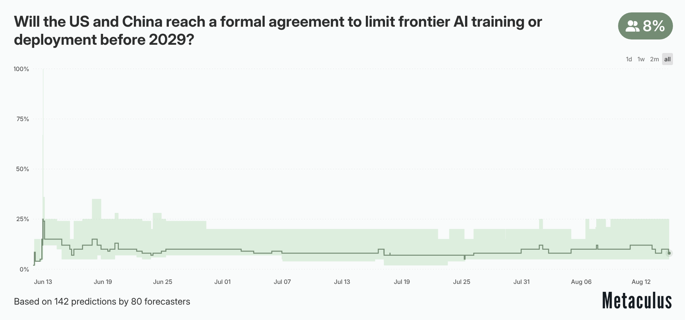
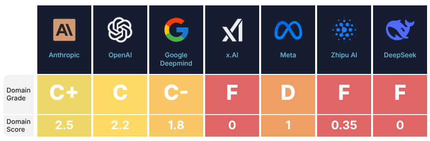
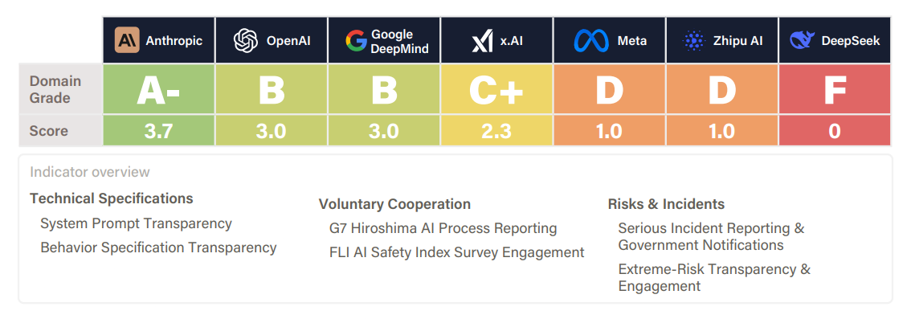
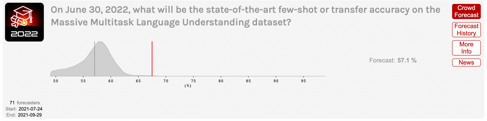
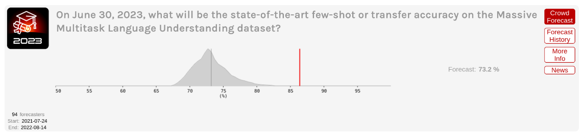
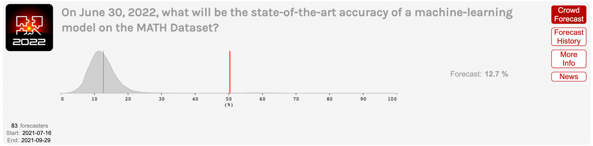

# Risk Amplifiers

**AI risks don't exist in isolation—they're amplified by the competitive and coordination dynamics surrounding AI development.** While individual AI systems might pose manageable risks, the broader ecosystem of how these systems are developed, deployed, and governed creates systemic pressures that can dramatically increase the likelihood and severity of harmful outcomes. These amplifying factors operate independently of any specific AI capability or failure mode, making them particularly important to understand and address.

## Race Dynamics

**Competitive pressures systematically undermine safety investments when speed provides decisive advantages.** AI development increasingly resembles what economists call a "winner-take-all" contest, where the first to achieve key capabilities captures disproportionate rewards. These rewards include first-mover advantages in capturing market share, access to the best talent and data, and the ability to set industry standards ([Cave & Ó hÉigeartaigh, 2018](https://dl.acm.org/doi/10.1145/3278721.3278780)). The result is a race dynamic where competitors face intense pressure to prioritize development speed over careful safety testing and risk mitigation. Unlike previous technological revolutions that unfolded over decades, AI capabilities are advancing at unprecedented speed. As one analysis noted, "*AI is emerging not in terms of centuries or decades, but in years and months*" ([Gruetzemacher et al., 2024](https://arxiv.org/abs/2410.03092)). This compressed timeline intensifies competitive pressures and reduces the time available for careful safety work that might take years to pay off.

**"Race to the bottom" dynamics emerge when safety becomes a competitive disadvantage.** Think about what happens when one company decides to reduce safety testing to accelerate deployment. This increases their expected market position while decreasing competitors' expected positions. Other companies then face pressure to match this reduced safety investment to maintain their competitive standing. The result is a collective action problem where all companies end up investing less in safety than they would prefer, while maintaining similar relative positions in the race ([Askell et al., 2024](https://arxiv.org/abs/1907.04534)). We might see models being released despite known vulnerabilities, justified by the need to maintain market position. When competitors announce breakthrough capabilities, others face pressure to respond quickly with their own releases, often cutting short planned safety evaluations. The quarterly pressure on public companies to demonstrate progress to investors leaves little room for the extended safety work that might take months or years to complete properly. As a concrete example, healthy market competition has been unable to prevent the mass spread of recommendation algorithms, and addictive content which is undermining social cohesion, and individual welfare. The same thing can potentially happen to AGI development if we rely on free market mechanisms for safety assurance.

<note-box>

<collapsed> True

<title> Why Don't Other Industries Race to the Bottom on Safety?

<content>

The pharmaceutical industry provides an example by contrast. Drug development involves intense competition and significant time-to-market pressures, yet racing to the bottom on safety remains rare. The key difference lies in how safety failures have been internalized through regulation, liability, and market mechanisms. Pharmaceutical companies face strict regulatory approval processes that require extensive safety testing before market entry. Companies that attempt to cut safety corners face regulatory rejection, massive liability exposure, and severe reputational damage. Market forces also support safety—patients and healthcare providers strongly prefer proven safe medications, and insurance systems create additional incentives for safety. This collectively raises the “bottom” that is acceptable for the entire field ([Askell et al., 2024](https://arxiv.org/abs/1907.04534)).

AI development currently lacks these stabilizing mechanisms. Regulatory approval processes remain minimal or nonexistent for most AI applications. Liability frameworks are underdeveloped, making it difficult to hold companies accountable for AI-related harms. Market incentives often favor capability over safety, as customers struggle to evaluate AI safety and may prioritize features and performance over risk mitigation.

</content>

</note-box>

**Racing amplifies all three risk categories through different pathways.** For misuse risks, racing increases the likelihood that powerful capabilities reach bad actors before adequate security measures are implemented—as seen when language models capable of generating misinformation and malware became widely available in 2022-2023 before robust countermeasures existed. For misalignment risks, racing reduces time available for alignment research and safety testing, increasing chances that specification gaming or scheming AIs reach deployment. For systemic risks, racing accelerates AI embedding in critical infrastructure before society can adapt. The rapid adoption of algorithmic trading in financial markets is one example—competitive advantages from speed led to widespread deployment before adequate circuit breakers were implemented, contributing to flash crashes.

<iframe-static-figure>

</iframe-static-figure>

<iframe src="https://www.metaculus.com/questions/embed/38418?theme=light&embedTitle=Will+the+US+and+China+reach+a+formal+agreement+to+limit+frontier+AI+training+or+deployment+before+2029%3F&zoom=all"></iframe>

<iframe-caption>

Race dynamics lead to it being difficult to collaborate and work together on mitigating the risks from AI. The forecast shows how unlikely it is that the USA and China would be willing to cooperate ([Metaculus, 2025](https://www.metaculus.com/questions/38418/us-and-china-reach-an-agreement-to-limit-frontier-ai-development-before-2029/))

</iframe-caption>

## Accidents

**Well-intentioned development can produce catastrophic outcomes through unintentional failures and human error.** Systems fail in ways their designers never anticipated, often despite careful planning and good intentions. In the Challenger spacecraft disaster, engineers intended a routine launch, but a missing O-ring seal caused an explosion and seven deaths ([Rogers Commission, 1986](https://en.wikipedia.org/wiki/Space_Shuttle_Challenger_disaster#Launch_and_failure)). In the Mariner 1 mission, scientists intended to explore Venus, but a missing hyphen in guidance code led to the destruction of the USD 80 million spacecraft ([Ceruzzi, 1989](https://mitpress.mit.edu/9780262530828/beyond-the-limits/)). The use of chlorofluorocarbons (CFCs) were intended to create fire extinguishers and refrigerants, but unknowingly created a hole in the ozone layer that threatened all life on Earth ([NASA, 2004](https://earthobservatory.nasa.gov/features/RemoteSensingAtmosphere/remote_sensing5.php)). No matter how advanced technology becomes, the fundamental necessity of precision and thorough validation remains unchanged.

<figure-caption>

The AI safety index report for summer 2025. The scores show the rigor and comprehensiveness of companies' risk identification and assessment processes for their current flagship models. The focus is on implemented assessments, not stated commitments ([FLI, 2025](https://futureoflife.org/wp-content/uploads/2025/07/FLI-AI-Safety-Index-Report-Summer-2025.pdf)).

</figure-caption>

**Accidents occur when AI systems cause harm through unintentional failures, despite developers having good intentions and following reasonable safety practices.** Unlike misuse (where humans deliberately cause harm) or misalignment (where AI systems knowingly act against developer intent), accidents happen when humans or AI decisions lead to harm without realizing the consequences. This includes failures from insufficient capabilities, missing information, coding errors, or inadequate testing ([Shah et al., 2025](https://arxiv.org/abs/2504.01849)). Just like the mariner 1 spacecraft crashing due to a single missing hyphen, in AI we can see potential accidents due to a single misplaced character. During GPT-2 training, OpenAI accidentally inverted the sign on the reward function - changing a plus to a minus. Instead of producing gibberish, this created a model that optimized for maximally offensive content while maintaining natural language fluency. As the researchers noted, "*This bug was remarkable since the result was not gibberish but maximally bad output. The authors were asleep during the training process, so the problem was noticed only once training had finished*" ([Ziegler et al., 2020](https://arxiv.org/abs/1909.08593)).

**"Move fast and break things" development culture conflicts fundamentally with the methodical testing required for accident prevention.** Aviation, pharmaceuticals, and nuclear engineering require extensive testing precisely because failures have severe and irreversible consequences. AI systems increasingly control critical infrastructure, financial markets, and life-affecting decisions where traditional software assumptions no longer apply. Yet instead of adopting safety norms from high-stakes industries, AI development often follows the "move fast and break things" mentality common in consumer software where failures create inconvenience rather than catastrophe.

**Preventing accidents requires us to be able to handle “unknown unknowns” that might occur after deployment.** Standard safety engineering practices like defense in depth, staged deployment, capability verification, and safety testing should significantly reduce accident risks when properly implemented. However, this requires rigorous application and enforcement through both industry standards and regulation ([Shah et al., 2025](https://arxiv.org/abs/2504.01849)).

<note-box>

<collapsed> True

<title> The Collingridge Dilemma

<content>

This dilemma essentially highlights the challenge of predicting and controlling the impact of new technologies. It posits that during the early stages of a new technology, its effects are not fully understood and its development is still malleable. Attempting to control - or direct it - is challenging due to the lack of information about its consequences and potential impact. Conversely, when these effects are clear and the need for control becomes apparent, the technology is often so deeply embedded in society that any attempt to govern or alter it becomes extremely difficult, costly, and socially disruptive.

</content>

</note-box>

## Indifference

**Companies sometimes proceed with harmful products despite knowing the risks, prioritizing profits over public safety.** This pattern repeats across industries when organizations discover their products cause harm but calculate that continued sales outweigh potential costs. Tobacco companies intended to create enjoyable products, learned they caused cancer through internal research, but continued marketing cigarettes and funded denial campaigns for decades, causing millions of deaths (Truth Initiative, 2020). Ford intended to create affordable cars, discovered the Pinto's fuel tank would explode in rear-end collisions, calculated that lawsuits would cost less than recalls, and proceeded with production, leading to preventable deaths (Dowie, 1977). Pharmaceutical companies intended to treat pain, learned about OxyContin's addiction risks through clinical trials, but continued aggressive marketing campaigns that fueled the opioid epidemic (Keefe, 2017). Each case followed the same pattern: good initial intentions, clear knowledge of harm, and deliberate decisions to proceed anyway.

**Competitive pressures might cause AI developers to discover safety risks but release systems anyway.** Unlike accidents (where harm occurs despite good intentions) or misuse (where bad actors deliberately cause harm), indifference happens when companies knowingly accept risks to maintain market position or revenue streams. Meta's internal research revealed that Instagram caused significant harm to teenage users' mental health, yet the company continued to design features known to be addictive while publicly denying the evidence ([Haugen, 2021](https://www.wsj.com/livecoverage/facebook-whistleblower-frances-haugen-senate-hearing/card/eFNjPrwIH4F7BALELWrZ)). As one lawsuit alleges, "*They purposefully designed their applications to addict young users, and actively and repeatedly deceiving the public about the danger posed to young people by overuse of their products*" ([Office of the Attorney General, 2023](https://www.mass.gov/news/ag-campbell-files-lawsuit-against-meta-instagram-for-unfair-and-deceptive-practices-that-harm-young-people)). This demonstrates how companies can prioritize engagement metrics over user wellbeing even when internal research clearly documents harm.

**Both safety and capability washing can replace genuine safety investment.** Just as companies engage in "greenwashing" by emphasizing minor environmental initiatives while avoiding substantial changes, we might also start seeing more instances of "safety washing" ([Ren et al., 2024](https://arxiv.org/abs/2407.21792)). This could include things like publicizing safety commitments while cutting corners on testing, skipping external red-teaming, and rationalizing away warning signs. This creates an appearance of safety consciousness that masks inadequate actual safety investment. Safety and ethics commitments become marketing tools rather than operational constraints, allowing companies to claim responsibility while maintaining competitive advantages through faster development cycles.

**Preventing indifference requires external accountability mechanisms that make safety violations costly.** Corporate indifference persists when companies can externalize the costs of their decisions onto society while capturing the benefits internally. Industries with strong safety records—aviation, pharmaceuticals, nuclear power—have developed robust liability frameworks, regulatory oversight, and professional standards that make safety failures extremely expensive for companies. AI development currently lacks these mechanisms, creating an environment where indifference can flourish unchecked ([Askell et al., 2024](https://arxiv.org/abs/1907.04534)). Without external pressure through regulation, liability, and market consequences, companies will continue to have incentives to prioritize short-term competitive advantages over long-term safety considerations.

## Collective Action Problems

<quote>

<speaker> Max Tegmark

<position> Professor at MIT, Life 3.0 Author, AI Safety Researcher

<date>

<source> ([Tegmark, 2023](https://time.com/6273743/thinking-that-could-doom-us-with-ai/))

<content>

Since we have such a long history of thinking about this threat and what to do about it, from scientific conferences to Hollywood blockbusters, you might expect that humanity would shift into high gear with a mission to steer AI in a safer direction than out-of-control superintelligence. Think again.

</content>

</quote>

**Collective action problems prevent the implementation of safety measures that would benefit everyone.** Even when all stakeholders agree that certain safety measures would be beneficial, structural barriers prevent their implementation. Individual actors face incentives to free-ride on others' safety investments or cannot credibly commit to cooperative agreements. Unlike race dynamics where competitive pressures directly undermine safety, collective action problems represent failures of cooperation that often arise as a consequence of competitive pressures.

**Political instability disrupts long-term cooperation frameworks.** AI safety cooperation requires sustained commitment over years or decades, but political systems operate on much shorter timescales. Elections and political transitions frequently disrupt safety-focused policies, as new leaders prioritize competitiveness over cooperation ([Gruetzemacher et al., 2024](https://arxiv.org/abs/2410.03092)). One concrete example of this is president Trump's rescission of Biden's AI executive order. The 2023 order required companies building powerful AI models to share safety details with the government, but this oversight disappeared due to political transition ([Whitehouse, 2025](https://www.whitehouse.gov/fact-sheets/2025/01/fact-sheet-president-donald-j-trump-takes-action-to-enhance-americas-ai-leadership/); [Whitehouse, 2025](https://www.whitehouse.gov/presidential-actions/2025/07/preventing-woke-ai-in-the-federal-government/)). Instability undermines both international agreements and domestic safety frameworks. When one administration negotiates safety standards and the next abandons them, long-term cooperation on global problems becomes nearly impossible.

<figure-caption>

The AI safety index report for summer 2025. These scores are for the information sharing category, they show how openly firms share information about products, risks, and risk-management practices. Indicators cover voluntary cooperation, transparency on technical specifications, and risk/incident communication ([FLI, 2025](https://futureoflife.org/wp-content/uploads/2025/07/FLI-AI-Safety-Index-Report-Summer-2025.pdf)). </figure-caption>

**Free-rider incentives undermine collective safety investment.** Each actor benefits when others invest in safety measures but prefers that others bear the costs. A company benefits when competitors develop better security practices (reducing overall ecosystem vulnerabilities) but would rather avoid the expense of implementing such measures themselves. Countries benefit when other nations restrict dangerous AI capabilities but prefer to maintain their own development advantages. This creates systematic underinvestment in safety relative to what would be socially optimal, even when all parties recognize the collective benefits.

**Commitment and enforcement problems prevent credible cooperation.** Even when a company does want to cooperate or develop safe AGI, they cannot credibly promise to maintain safety standards without external enforcement mechanisms. Companies may genuinely intend to prioritize safety but face shareholder pressure to cut corners when competitors gain advantages due to the race dynamics we talked about in a previous section. Countries may sign safety agreements while secretly continuing development through classified programs or private companies. Without reliable enforcement, agreements become empty talk that collapses under competitive pressure.

**Coordination failures amplify risks by preventing collective safeguards.** Many AI risks require coordinated responses that individual actors cannot implement unilaterally. Preventing AI-enabled cyberattacks requires international cooperation on cybersecurity norms and enforcement. Addressing systemic risks from AI deployment requires coordination among companies, regulators, and international bodies to develop oversight mechanisms. When coordination fails, individual actors cannot implement adequate safeguards alone—one company's strong security measures provide limited protection if competitors deploy vulnerable systems that bad actors can exploit ([Askell et al., 2024](https://arxiv.org/abs/1907.04534)).

<note-box>

<collapsed> True

<title> Learning from Coordination in other domains

<content>

Climate change provides both cautionary lessons and potential models for AI governance cooperation. Like AI, climate change involves global coordination challenges, long-term risks, and conflicts between immediate economic interests and collective safety. However, climate governance has achieved some notable successes alongside its well-known failures.

The Montreal Protocol, which successfully addressed ozone depletion, demonstrates how international cooperation can work when certain conditions are met: clear scientific consensus on risks, identifiable alternative technologies, and economic arrangements that address distributional concerns. The protocol included mechanisms for technology transfer and financial assistance that made cooperation attractive to developing countries.

AI governance could benefit from similar approaches. Technical cooperation on AI safety research could parallel the scientific cooperation that underpinned climate agreements. Economic arrangements could address concerns that safety measures disadvantage particular countries or companies. Monitoring and verification mechanisms could build on precedents from arms control and environmental agreements.

However, AI governance faces additional challenges that climate governance doesn't. AI development is faster-moving, involves more diverse actors, and has more immediate competitive implications. These differences suggest that AI governance may require new institutional innovations rather than simply adapting existing frameworks.

</content>

</note-box>

## Unpredictability

**AI capabilities have consistently surprised experts for over a decade.** This is creating a persistent pattern where researchers underestimate how quickly breakthroughs will emerge. This pattern reinforces how difficult forecasting AI capabilities and risks truly is, amplifying every category of AI risk by undermining preparation timelines and institutional planning.

**In 2021, experts dramatically underestimated progress on challenging benchmarks like MATH and MMLU.** In mid-2021, ML professor Jacob Steinhardt ran a forecasting contest with professional superforecasters to predict progress on two challenging benchmarks. For MATH, a dataset of competition math problems, forecasters predicted the best model would reach 12.7 $%$ accuracy by June 2022, with many considering anything above 20$%$ extremely unlikely. The actual result was 50.3$%$—landing in the far tail of their predicted distributions. Similarly, for MMLU, forecasters predicted modest improvement from 44$%$ to 57.1$%$, but performance reached 67.5$%$ ([Steinhardt, 2022](https://www.lesswrong.com/posts/CJw2tNHaEimx6nwNy/ai-forecasting-one-year-in); [Cotra, 2023](https://www.planned-obsolescence.org/language-models-surprised-us/)).

**In 2022, the underestimation continued even after these dramatic surprises.** In Steinhardt's follow-up contest for 2023, forecasters again underestimated progress. For MATH, the result of 69.6$%$ fell at Steinhardt's 41st percentile, while MMLU's 86.4$%$ result fell at his 66th percentile. Even though forecasters underpredicted progress, experts underpredicted progress even more: "Progress in AI (as measured by ML benchmarks) happened significantly faster than forecasters expected" ([Steinhardt, 2023](https://www.lesswrong.com/posts/SdkexhiynayG2sQCC/ai-forecasting-two-years-in); [Cotra, 2023](https://www.planned-obsolescence.org/language-models-surprised-us/)).

<figure-caption>

2021 forecast on the MMLU (Measuring Massive Multitask Language Understanding) dataset. The majority of the probability density of the forecast was between 44 percent to 57 percent by June 2022. The actual recorded performance was 68 percent (shown as the red line) ([Cotra, 2023](https://www.planned-obsolescence.org/language-models-surprised-us/)). </figure-caption>

<figure-caption>

2022 forecast on the MMLU (Measuring Massive Multitask Language Understanding) dataset. The majority of the probability density of the forecast was between 68 percent to 80 percent by June 2023. The actual recorded performance was 87 percent (shown as the red line) ([Steinhardt, 2022](https://www.lesswrong.com/posts/CJw2tNHaEimx6nwNy/ai-forecasting-one-year-in)). </figure-caption>

<figure-caption>

2021 forecast on the MATH dataset. The majority of the probability density of the forecast was between 5 percent to 20 percent by June 2022. The actual recorded performance was 50 percent (shown as the red line) ([Cotra, 2023](https://www.planned-obsolescence.org/language-models-surprised-us/)). </figure-caption>

**During 2022-2024, experts continued underestimating qualitative capabilities even after witnessing benchmark surprises.** AI Impacts surveyed ML experts in mid-2022, just months before ChatGPT's release. Experts predicted milestones like "write a high school history essay" or "answer easily Googleable questions better than an expert" would take years to achieve. ChatGPT and GPT-4 accomplished these within months of the survey, not years ([Cotra, 2023](https://www.planned-obsolescence.org/language-models-surprised-us/)).

**Examples in 2024-2025 seem to continue this pattern of unpredictability.** In December 2024, OpenAI's o3 achieved 87.5$%$ on ARC-AGI, a benchmark specifically designed to test abstract reasoning and resist gaming through memorization ([Chollet et al., 2024](https://arxiv.org/abs/2412.04604)). For four years, progress had crawled from GPT-3's 0$%$ in 2020 to GPT-4o's 5$%$ in 2024, leading many to expect meaningful progress would take years. The rapid jump from 5$%$ to 87.5$%$ caught many by surprise. Similarly, on Frontier Math—a benchmark of research-level problems described by world-leading mathematicians as “*our best guesses for challenges that would stump AI*”— OpenAI o3 jumped from the previous best of 2$%$ to 25$%$ within months of the benchmark's November 2024 release ([Epoch AI, 2024](https://epoch.ai/frontiermath)).

**Unpredictability amplifies all other AI risks.** Systematic underestimation of breakthrough timing leaves safety researchers perpetually playing catch-up when the stakes are highest. Douglas Hofstadter, who once expected hundreds of years before human-like AI, now describes "a certain kind of terror of an oncoming tsunami that is going to catch all humanity off guard" ([Hofstadter, 2023](https://www.youtube.com/watch?v=lfXxzAVtdpU&t=1763s&ref=planned-obsolescence.org)). When even leading researchers consistently underestimate progress in their own field, society's broader preparation becomes fundamentally miscalibrated. Organizations make deployment decisions based on forecasts that consistently underestimate near-term progress, while governance systems assume gradual, predictable advancement. This creates a persistent gap between when dangerous capabilities emerge and when adequate safety measures are ready—turning unpredictability itself into a systemic risk amplifier.

<quote>

<speaker> Douglas Hofstadter

<position> Physicist, computer scientist and professor of cognitive science, author of Gödel, Escher, Bach

<date>

<source> ([Hofstadter, 2023](https://www.youtube.com/watch?v=lfXxzAVtdpU&t=1763s&ref=planned-obsolescence.org))

<content>

This started happening at an accelerating pace, where unreachable goals and things that computers shouldn't be able to do started toppling [...] systems got better and better at translation between languages, and then at producing intelligible responses to difficult questions in natural language, and even writing poetry [...] The accelerating progress has been so unexpected, so completely caught me off guard, not only myself but many, many people, that there is a certain kind of terror of an oncoming tsunami that is going to catch all humanity off guard.

</content>

</quote>