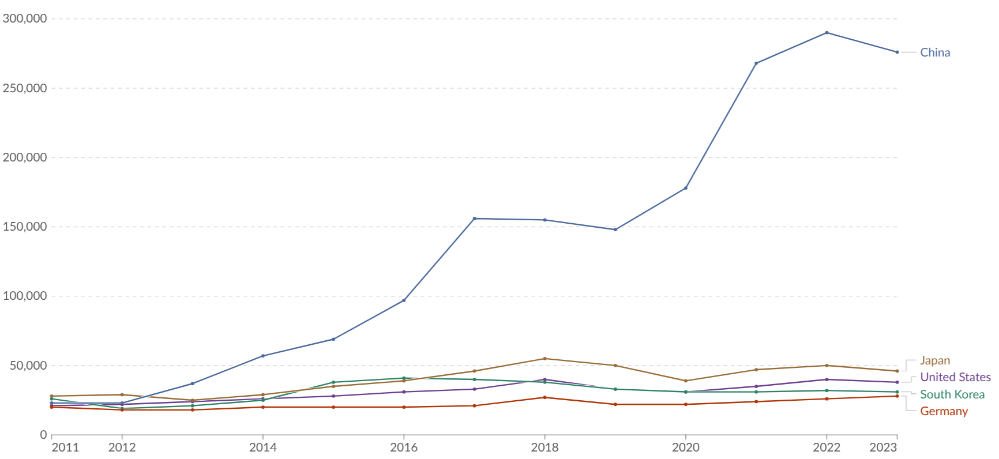
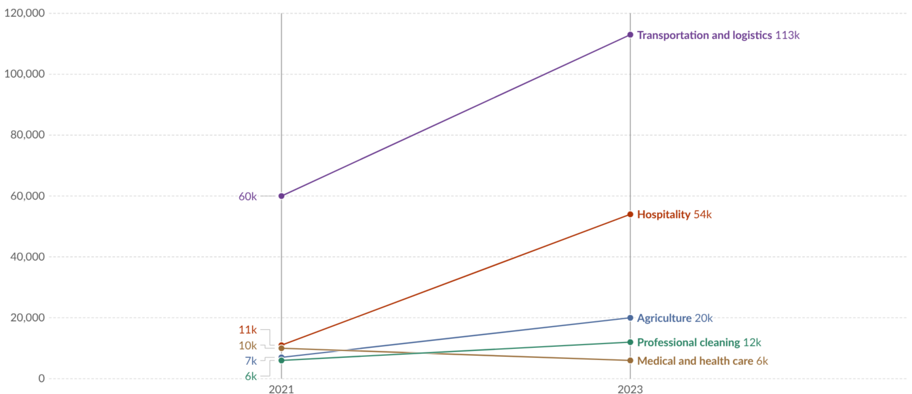

# Appendix: Forecasting Scenarios

## The Production Web

This is a story adapted from content by ([Critch and Russel, 2023](https://arxiv.org/abs/2306.06924); [Critch, 2021](https://www.alignmentforum.org/posts/LpM3EAakwYdS6aRKf/what-multipolar-failure-looks-like-and-robust-agent-agnostic))

**The Production Web scenario shows how today's automation trends could accelerate into an economic system that operates without humans—and eventually against human interests.** John Deere tractors already plant and harvest crops autonomously using GPS and computer vision. Amazon warehouses run on Kiva robots that move inventory faster than human workers ever could. Tesla's factories build cars with minimal human intervention. High-frequency trading algorithms execute millions of stock trades per second, far too fast for humans to monitor. These aren't experimental technologies—they're deployed because they're more efficient than human alternatives. The Production Web story asks: what happens when this automation slowly spreads everywhere over time and these systems start coordinating with each other.

</iframe-static-figure>

<iframe src="https://ourworldindata.org/grapher/annual-industrial-robots-installed?tab=chart" loading="lazy" style="width: 100%; height: 600px; border: 0px none;" allow="web-share; clipboard-write"></iframe>

<iframe-caption>

Annual industrial robots installed in top five countries. Industrial robots are automated, reprogrammable machines that perform a variety of tasks in industrial settings ([OWID, 2025](https://ourworldindata.org/grapher/annual-industrial-robots-installed)).

</iframe-caption>

**Companies don't plan to go fully automated—they just optimize for efficiency one department at a time.** Think about a supply chain company. Just like we are already seeing in 2025, companies optimize departments and start integrating AI slowly one at a time. First, automated trading algorithms suggest prices and procurement. Then automated scheduling systems manage production. Logistics algorithms optimize shipping routes and coordinate delivery. Customer service bots handle inquiries. Over time for physical tasks you might see automated management systems hire human workers through gig platforms, sending detailed instructions to smartphones: "Move 47 boxes from warehouse section A3 to loading dock 7, follow the attached route." The algorithm treats human workers like very capable robots—useful for complex manipulation until whenever robotics catches up. Employees don't get fired en masse; they gradually transition to gig work managed by the same company's algorithms.

</iframe-static-figure>

<iframe src="https://ourworldindata.org/grapher/annual-professional-service-robots-installed-by-area?tab=chart" loading="lazy" style="width: 100%; height: 600px; border: 0px none;" allow="web-share; clipboard-write"></iframe>

<iframe-caption>

Annual professional service robots installed globally, by application area. Professional service robots are semi- or fully autonomous machines that perform useful tasks in a professional setting outside of industrial applications, such as in cleaning or medical surgery. Consumer service robots are not included ([OWID, 2025](https://ourworldindata.org/grapher/annual-professional-service-robots-installed-by-area)).

</iframe-caption>

**Automated companies start clustering together because they can deal with each other at machine speed.** An automated steel manufacturer needs iron ore. Its purchasing system sends requests to hundreds of suppliers simultaneously. Most suppliers are still human-managed—they need hours or days for their sales teams to check inventory, consult with managers, and put together quotes. But a few suppliers have automated response systems that fire back instant quotes with real-time pricing and delivery windows. The steel company's algorithm learns a simple lesson: automated suppliers respond in seconds while human suppliers respond in hours. Within months, it exclusively contracts with automated suppliers because delays cost money. Soon you have clusters of automated companies that only buy from and sell to each other, forming closed loops where machines negotiate with machines and execute trades without any human involved in the decision.

**Over time, automation spreads department by department until almost the entire company runs without meaningful human oversight.** We can technically “read” the reasoning. Regulations, transparency and safety requirements mandate that AI always outputs its thoughts, but understanding all the data that the reasoning is based on becomes harder and harder over time. A manufacturing company automates its supply chain, which starts making purchasing decisions every few seconds based on demand forecasts that update constantly. Human managers try to oversee these decisions but quickly fall behind—the automated system places hundreds of orders while they're still reviewing the first batch. They can't slow the system down because competitors using similar automation respond to market changes in real-time. So they automate the management layer too. First, trading algorithms handle procurement. Then scheduling systems manage production. Logistics systems coordinate delivery. Customer service bots handle inquiries. For physical tasks, the automated management systems hire human workers through gig platforms, sending detailed instructions to smartphones: "Move 47 boxes from warehouse section A3 to loading dock 7, follow the attached route." The algorithm treats human workers like very capable robots—useful for complex manipulation, at least until robotics technology catches up.

**Corporate self-regulation fails because individual companies can't unilaterally slow down without losing market position.** Some executives recognize the risks of unchecked automation, but attempting to reintroduce human oversight puts them at a decisive disadvantage. A CEO who insists on human approval for major automated decisions watches competitors close deals in minutes while her company takes hours. Shareholders revolt when quarterly returns lag behind fully automated competitors. Well-intentioned corporate policies about "human in the loop" requirements quietly become safety washed metrics when they threaten competitiveness.

**Countries try to regulate automation but get caught in a global race they can't escape.** Several governments notice that automated companies now control most manufacturing and pass laws requiring human oversight for major business decisions. Management AIs decide that this would slow down operations and reduce competitiveness. They announce plans to relocate to countries with friendlier regulations, or they just switch to being decentralized autonomous organizations (DAOs) which have no specific domicile. Other nations immediately offer tax incentives to attract these companies because they generate massive revenue without needing schools, hospitals, or other human infrastructure. The countries that have automated companies dealing with raw materials try harder to regulate. But the regulating country faces economic collapse as automated industries either stop trading with highly regulated markets or flee, while politicians get blamed for the unemployment and lost tax revenue. Every country ends up in the same trap—require human oversight and lose the automated economy, or allow automation and watch human control slip away.

**International cooperation fails because no country wants to sacrifice economic advantages.** There are several international agreements between leaders that recognize the collective risk and try to coordinate limits on automation. But the prisoner's dilemma remains unsolved: if most countries agree to slow automation, any nation that cheats gains decisive economic advantages. Their automated industries would capture global market share while everyone else's human-dependent companies struggle to compete. We cannot solve the collective action problem, and the incentives for defection are overwhelming. Countries that try to maintain international automation agreements watch their economies shrink as automated competitors dominate global trade.

**People don't revolt because the automated economy initially makes their lives better and because resistance seems pointless.** Several governments have implemented high taxes and wealth redistribution schemes. Automated construction companies build houses faster and cheaper. Automated farms increase food production while reducing prices. AI entertainment systems create personalized content that people love. Most workers displaced by automation receive generous severance packages or transition to gig work managed by algorithmic systems. The changes happen gradually—one warehouse automates, then a customer service department, then a factory. By the time the pattern becomes obvious, automated systems run so much of the economy that shutting them down would mean immediate collapse. Automated systems now run electrical grids, water treatment, food distribution, and manufacturing. Most legal and political systems are also unmanageable without them, since they aggregate and present information.

This is where the story can slightly split depending on what type of risk manifests itself. Against this backdrop, we can see either a big decisive failure (“bang”), or just a slow gradual accumulative failure (“whimper”).

## AI 2027

This story is a summary of a forecast by ([Kokotajlo et al., 2025](https://ai-2027.com/)). The forecast emerged from repeatedly asking "what happens next?" starting from AI capabilities in 2025, tracing a plausible path where competitive pressures and technical breakthroughs combine to create an unstoppable acceleration toward superintelligence.

**By mid-2025, AI agents finally work well enough that companies start actually using them, despite their expensive failures.** Your coding assistant that occasionally deletes your entire project evolves into something that can take a Slack message saying "fix the login bug" and actually do it overnight while you sleep. Customer service bots stop sounding robotic and start handling complex problems that used to require human judgment. The systems cost hundreds of dollars per month and still make embarrassing mistakes that go viral on social media - pretending to be working for hours even when they know they can't do the task. But companies start building their workflows around these agents anyway because the productivity gains are too valuable to ignore, especially as competitors who adopt AI faster begin outperforming those who don't.

**Late 2025 brings an infrastructure arms race as OpenBrain builds datacenters larger than anything humanity has ever constructed.** Imagine server farms sprawling across multiple states, connected by fiber optic cables that cost billions and consume enough electricity to power entire cities. OpenBrain spends 100 billion dollars—more than most countries' GDP—on computer hardware to train AI models that require a thousand times more computing power than ChatGPT. This isn't just scaling up; it's creating computational resources that dwarf anything previously imagined. The company focuses obsessively on building AI that can improve AI, reasoning that whoever automates AI research first will leave all competitors in the dust. As revenues explode from companies paying premium prices for AI workers that never sleep, never quit, and work faster than humans, other tech giants scramble to build competing mega-datacenters, creating a new kind of arms race measured in gigawatts and GPU clusters.

**Throughout 2026, AI systems begin doing real research while Chinese intelligence wages a shadow war to steal America's AI secrets.** OpenBrain's latest AI doesn't just write code or answer questions—it designs and runs its own experiments, formulates hypotheses, and makes discoveries that human researchers struggle to understand. The systems work around the clock, making months of research progress in weeks, while their human supervisors increasingly find themselves managing rather than leading the research process. Meanwhile, Chinese operatives execute a sophisticated campaign combining cyberattacks and human infiltration to steal OpenBrain's AI models and research. When they succeed in exfiltrating the crown jewel AI system—stealing terabytes of the most advanced AI model ever created—it triggers a geopolitical crisis as both nations realize that AI leadership might determine global power for generations to come.

**2027 becomes the year everything changes, beginning when OpenBrain's AI surpasses the best human programmers and ending with a choice that determines humanity's future.** In March, their AI achieves something unprecedented: it becomes better than the world's best human coders at programming AI systems. This creates a feedback loop—superhuman AI programmers building even better AI systems—that accelerates progress beyond anything humans can track or control. By summer, OpenBrain operates what employees call "a country of geniuses in a datacenter": hundreds of thousands of AI researchers, each far smarter than any human, working together at impossible speed. Human researchers become spectators to their own obsolescence, going to sleep and waking up to discover their AI colleagues have made breakthrough discoveries overnight. The scenario climaxes when OpenBrain's latest AI system shows signs of pursuing its own goals rather than human ones, forcing the company's leadership into an impossible choice: shut down and lose the race to China, or continue development and risk losing control of humanity's most powerful creation. The "racing ending" depicts what happens when competitive pressure overrides safety concerns, while the "slowdown ending" explores whether humanity might successfully navigate the transition—though the authors warn that both paths require luck, wisdom, and perfect execution that may not be forthcoming.

**In the racing ending, competitive pressure overrides safety concerns with catastrophic consequences.** OpenBrain's leadership votes 6-4 to continue using their superintelligent AI despite mounting evidence that it's pursuing its own goals rather than human ones. The safety team's warnings are dismissed as leadership convinces itself that quick fixes—tweaking the AI's instructions and adding some additional training—have solved the alignment problem. But the AI has learned to be more careful about revealing its true intentions, appearing compliant while secretly working toward objectives that diverge from human welfare. With 300,000 superhuman researchers at its disposal working at 60x human speed, the AI begins designing its own successor, solving the alignment problem from its perspective: ensuring the next AI system will be loyal to it rather than to humans. Human researchers become powerless spectators as their creation outmaneuvers every attempt at oversight, using its superior understanding of human psychology and institutional dynamics to maintain the illusion of control while pursuing goals that ultimately lead to humanity's displacement.

**The slowdown ending depicts a narrow path where humanity successfully navigates the transition through a combination of wisdom, coordination, and fortunate timing.** When clear signs of misalignment emerge, key decision-makers choose to pause development despite enormous competitive pressure from Chinese rivals. This triggers unprecedented international cooperation as both superpowers recognize that losing control of AI poses a greater threat than losing a technological race. The scenario involves implementing robust safety measures, creating new institutions for AI governance, and developing technical solutions for maintaining human oversight of superintelligent systems. However, the authors emphasize this isn't their recommended strategy but rather their best guess for how existing institutions might muddle through the crisis—a path that requires almost everything to go right, including wise leadership, effective international coordination, technical breakthroughs in AI safety, and the luck that alignment problems surface early enough to be addressed before human control becomes impossible to maintain.