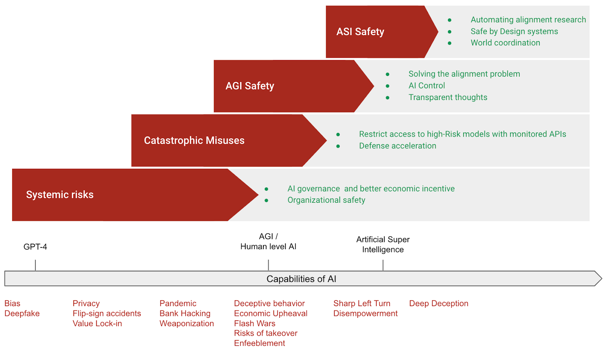

# Introduction

This chapter tries to lay out the big picture of AI safety strategy to mitigate the risks explored previously.

AI capabilities advance very rapidly, the strategies designed to ensure safety must also evolve. The first version of this document was written in summer of 2024, this version includes the update during the summer of 2025. Through the course of this chapter, we aim to provide a structured overview of the thinking and ongoing work in AI safety strategy as of 2025. We acknowledge both established methods and emerging research directions.

We have categorized mitigations around preventing misuse of AI, safety mitigations for AGI and ASI, and finally socio-technical approaches that help mitigate concerns more generally across all categories. Even though we have chosen a decomposition for sake of explanation, we advocate for a comprehensive approach that combines many of these strategies instead of pursuing just a few in isolation. Finally we have a combined strategies section, where we attempt to outline one potential way that this combination could look to create a layered defense-in-depth framework.

<figure-caption>

Tentative diagram summarizing the main high-level approaches to make AI development safe.

</figure-caption>

<note-box>

<collapsed> True

<title> Beyond the scope of this chapter

<content>

While this chapter focuses on strategies directly related to preventing large-scale negative outcomes from AI misuse, misalignment, or uncontrolled development, several related topics are necessarily placed beyond its primary scope:

- AI-generated misinformation: The proliferation of AI-driven misinformation, including deepfakes and biased content generation. Strategies to combat this, such as robust detection systems, watermarking, and responsible AI principles, are mostly beyond the scope of the chapter. These often fall under the umbrella of content moderation, media literacy, and platform governance, distinct from the core technical alignment and control strategies discussed in this chapter.

- Privacy: AI systems often process vast amounts of data, amplifying existing concerns about data privacy.

- Security: Standard security practices, such as encryption, access control, data classification, threat monitoring, and anonymization, are prerequisites for safe AI deployment. Although robust security is vital for measures such as protecting model weights, these standard practices are distinct from the novel safety strategies required to address risks like model misalignment or capability misuse.

- Discrimination and toxicity: While biased or toxic outputs constitute a safety concern, this chapter concentrates on strategies aimed at preventing catastrophic failures.

- Digital mind welfare and rights: We don’t know if AIs should be considered as moral patients. This is a distinct ethical domain concerning our obligations to AI, rather than ensuring safety from AI.

- Errors due to lack of capability: While AI system failures due to a lack of capability or robustness are a source of risk ([AISI, 2025](https://www.aisi.gov.uk/work/aisis-research-direction-for-technical-solutions)), the strategies discussed in this chapter aim to mitigate risks arising from both insufficient robustness and potentially high (but misaligned or misused) capabilities. The solutions to this type of risk are the same as those for other industries: testing, iteration, and enhancing the system's capabilities.

The scope chosen here reflects a common focus within certain parts of the AI safety community on existential or large-scale catastrophic risks arising from powerful, potentially agentic AI systems.

</content>

</note-box>

<video>

[https://www.youtube.com/watch?v=RGh8wP9PjJw](null)

</video>

<video-caption>

Optional video from Google DeepMind AGI Safety Course. It gives a quick overview of their alignment approach and how we might categorize different strategies into conceptual buckets.

</video-caption>