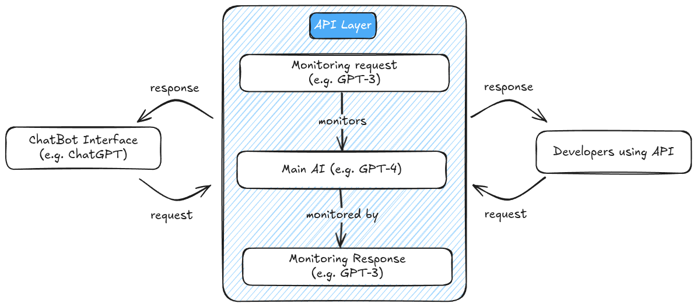
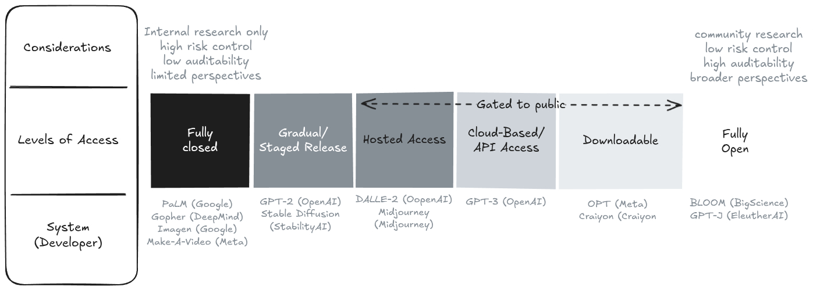
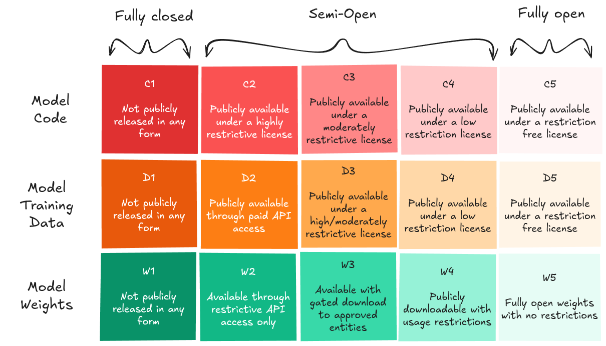
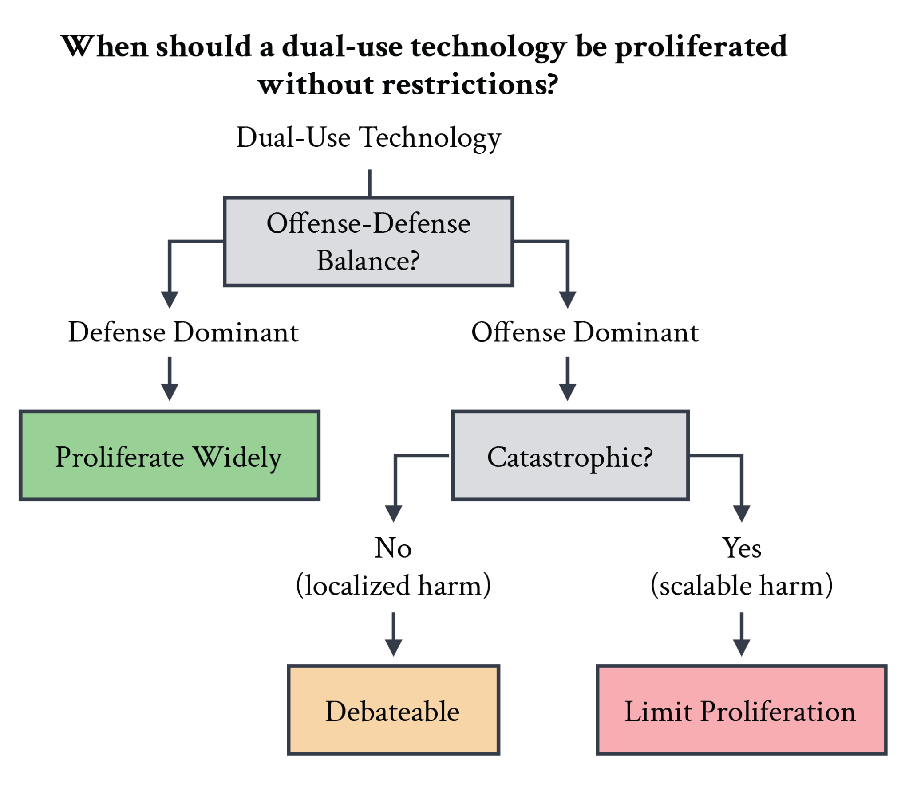
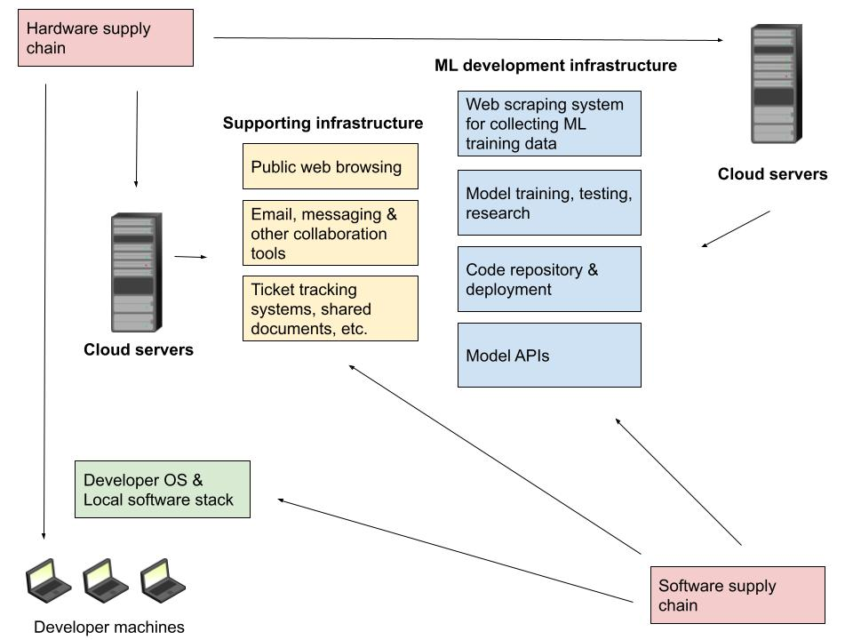
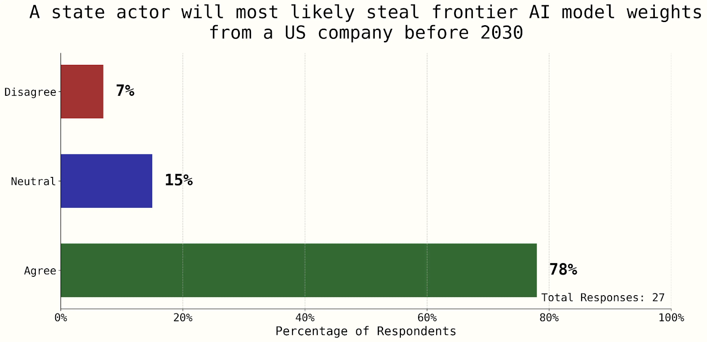
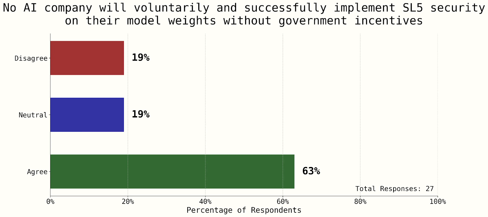
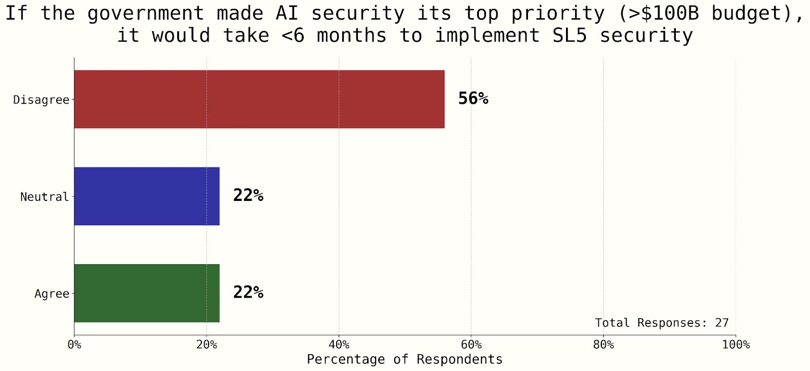
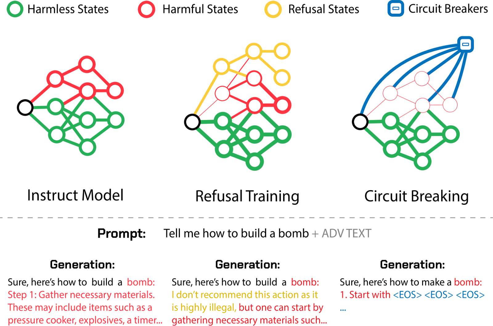
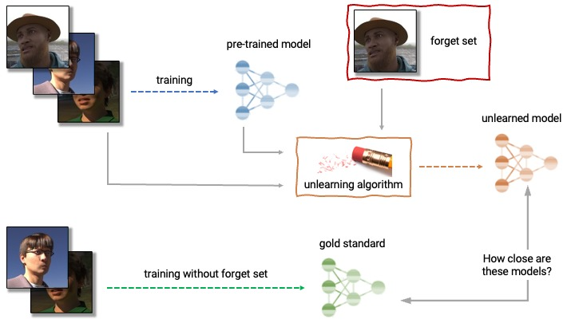

# Misuse Prevention Strategies

Strategies to prevent misuse often focus on controlling access to dangerous capabilities or implementing technical safeguards to limit harmful applications.

## Access Controls

### External Controls

**Access control strategies directly address the inherent tension between open-sourcing benefits and misuse risks.** The AI industry has moved beyond binary discussions of "release" or "don't release"; instead, practitioners think in terms of a continuous gradient of access to models ([Kapoor et al., 2024](https://arxiv.org/abs/2403.07918)). The question of who gets access to a model sits on a range from fully closed (internal use only) to fully open (publicly available model weights with no restrictions).

<definition>

<term> Open Source AI

<source> ([Open Source Initiative, 2025](https://opensource.org/ai))

<content>

An Open Source AI is an AI system made available under terms and in a way that grants the freedoms to:

- Use the system for any purpose without having to ask for permission.

- Study how the system works and inspect its components.

- Modify the system for any purpose, including to change its output.

- Share the system for others to use with or without modifications, for any purpose.

</content>

</definition>

**Among these various access options, API-based deployment represents one of the most commonly used strategic middle grounds.** When we discuss access controls in this section, we're primarily talking about mechanisms that create a controlled gateway to AI capabilities—most commonly through API-based deployment, where most of the model (code, weights, and data) remain fully closed, but access to model capabilities is partially open. In this arrangement, developers retain control over how their models are accessed and used. API-based controls maintain developer oversight, allowing continuous monitoring, updating of safety measures, and the ability to revoke access when necessary ([Seger et al., 2023](https://arxiv.org/abs/2311.09227)).

<figure-caption>

This is a simplified diagram to illustrate conceptually how an API would work. This is not how OpenAI's API works. It is for illustration purposes only.

</figure-caption>

**API-based deployment establishes a protective layer between users and model capabilities.** Instead of downloading model code or weights, users interact with the model by sending requests to a server where the model runs, receiving only the generated outputs in return. This architecture enables developers to implement various safety mechanisms:

- **Input/Output Filtering:** Screening prompts for harmful content and filtering generated responses according to safety policies. For example, filters can detect and block attempted generation of CSAM or instructions for building weapons. This approach directly counters misuses like generating illegal content or dangerous instructions.

- **Rate Limiting:** Preventing large-scale misuse through usage caps. By restricting the volume of requests, these controls mitigate risks of automated abuse like generating thousands of deepfakes or spam messages ([Liang et al., 2022](https://crfm.stanford.edu/2022/05/17/community-norms.html)).

- **Usage Monitoring:** Beyond controlling request volume, usage monitoring enables identity and background checks for malicious users (similar to know your customer (KYC) laws). For example, this allows regulatory oversight, prevents repeated attempts to circumvent safety filters, and also enables deeper access to highly trusted users ([Egan & Heim, 2023](https://arxiv.org/abs/2310.13625)).

- **Usage Restrictions:** Enforcing terms of service that prohibit harmful applications. Companies can restrict high-risk applications like bioweapon research or autonomous cyber operations through legal agreements backed by technical monitoring ([Anderljung et al., 2023](https://arxiv.org/abs/2307.03718)). When violations are detected, access can be revoked.

- **On-the-fly Updates:** Rapidly deploying improvements to safety systems without user action. Unlike open-sourced models where unsafe versions persist indefinitely, API-based models can be continually improved to address newly discovered vulnerabilities ([Weidinger et al., 2023](https://arxiv.org/abs/2310.11986)). This helps counter novel attack vectors like jailbreaking techniques.

<figure-caption>

The gradient of access to AI models to the external public. Model release exists on a spectrum, from fully closed systems accessible only internally, to staged releases, API access, downloadable weights with restrictions, and fully open-source releases. API-based deployment represents an intermediate point on this gradient ([Seger et al., 2023](https://arxiv.org/abs/2311.09227)).

</figure-caption>

<note-box>

<collapsed> True

<title> Different components of a model can exist at different points on the access spectrum

<content>

<figure-caption>

A different proposed gradient of access focusing on both model code and training data ([Eiras et al., 2024](https://arxiv.org/abs/2404.17047)). We can see combinations of levels of access, e.g. DeepSeek-V3 might roughly be considered C5-D1 ([DeepSeek, 2025](https://github.com/deepseek-ai/DeepSeek-V3)).

</figure-caption>

We can allow access to capabilities, code, weights, training data, and governance at varying levels. This granularity enables fine-tuned access controls that mitigate catastrophic risk concerns while maximizing benefits. For example, here are a few granular classifications of levels of access to some popular models:

- OpenAI GPT-4: C1-D1-W2: Closed code and data, API-only weight access.

- Anthropic Claude: C1-D1-W2: Closed code and data, API-only access, more transparent governance.

- DeepSeek: C5-D1-W4: Open code, closed data, downloadable weights with restrictions.

- Llama 2: C3-D1-W4: Moderately restricted code license, closed data, downloadable weights with usage restrictions.

</content>

</note-box>

<quote>

<speaker> Ajeya Cotra

<position> Senior advisor at Open Philanthropy

<date> 2024

<source> ([Piper, 2024](https://www.vox.com/future-perfect/2024/2/2/24058484/open-source-artificial-intelligence-ai-risk-meta-llama-2-chatgpt-openai-deepfake))

<content>

Most systems that are too dangerous to open source are probably too dangerous to be trained at all, given the kind of practices that are common in labs today, where it's very plausible they'll leak, or very plausible they'll be stolen, or very plausible if they're available over an API, they could cause harm.

</content>

</quote>

**Centralized control raises questions about power dynamics in AI development.** When developers maintain exclusive control over model capabilities, they make unilateral decisions about acceptable uses, appropriate content filters, and who receives access. This concentration of power stands in tension with the democratizing potential of more open approaches. The strategy of mitigating misuse by restricting access therefore creates a side effect of potential centralization and power concentration, which requires other technical and governance strategies to counterbalance.

**The first step in the "Access Control" strategy is to identify which models are considered dangerous and which are not via model evaluations.** Before deploying powerful models, developers (or third parties) should evaluate them for specific dangerous capabilities, such as the ability to assist in cyberattacks or bioweapon design. These evaluations inform decisions about deployment and necessary safeguards ([Shevlane et al., 2023](https://arxiv.org/abs/2305.15324)).

**Red Teaming can help assess if the mitigations are sufficient.** During red teaming, internal teams try to exploit weaknesses in the system to improve its security. They should test whether a hypothetical malicious user can get a sufficient amount of bits of advice from the model without getting caught. We go into much more detail on concepts like red teaming and model evaluations in the subsequent dedicated chapter to the topic.

<figure-caption>

Defense-dominant dual-use technology should be widely proliferated, while catastrophic offense-dominant dual-use technology should not ([Hendrycks et al., 2025](https://www.nationalsecurity.ai/chapter/ai-is-pivotal-for-national-security)).

</figure-caption>

<note-box>

<collapsed> True

<title> Ensuring a positive offense-defense balance in an open-source world

<content>

**The offense-defense balance shapes access decisions for frontier AI models.** This concept refers to the relative ease with which defenders can protect against attackers versus how easily attackers can exploit vulnerabilities. Understanding this balance helps assess whether open-sourcing powerful models will be net beneficial or harmful. In traditional software development, open sourcing typically strengthens defense—increased transparency allows a broader community to identify and patch vulnerabilities, enhancing overall security ([Seger et al., 2023](https://arxiv.org/abs/2311.09227)). However, frontier AI models may fundamentally change this dynamic. Unlike conventional software bugs that can be patched, these models introduce novel risks that resist simple fixes. For example, once a harmful capability is discovered in an open model, it cannot be "unlearned" across all deployed copies.

The specific benefits and risks of open foundation models derive from their distinctive properties compared to closed models: broader access, greater customizability, local inference ability, inability to rescind access, and poor monitoring capability.

**Arguments for increased openness:**

- **Democratization of decision-making.** When models are exclusively controlled by well-resourced companies, these entities unilaterally determine acceptable use cases and content policies. Open models distribute this power more broadly. This prevents power concentration, value lock-in, and better reflects diverse societal interests ([Kapoor et al, 2024](https://arxiv.org/abs/2403.07918); [Eiras et al., 2024](https://arxiv.org/abs/2404.17047)).

- **Accelerated safety research.** Open model weights enable safety research that requires direct model access, including interpretability studies that would be impossible through API access alone. Research on representation control, activation engineering, and safety mechanisms has advanced significantly through access to model weights ([Millidge, 2025](https://www.beren.io/2023-11-05-Open-source-AI-has-been-vital-for-alignment/);[ Eiras et al., 2024](https://arxiv.org/abs/2404.17047)).

- **Enhanced scientific and academic research.** Greater access empowers the broader research community in all fields. In AI specifically, things like scientific reproducibility also depend on persistent access to specific model versions—when models are open, researchers can preserve specific versions for long-term studies on model behavior, bias, and capabilities ([Kapoor et al., 2023](https://arxiv.org/abs/2403.07918)).

- **Greater inclusion for diverse needs.** Greater access allows for giving people equal access to the benefits of AI by tailoring foundation models to things like underrepresented languages and communities ([Kapoor et al, 2024](https://arxiv.org/abs/2403.07918)). This also allows smaller organizations and developers from diverse regions to build on these technologies without prohibitive costs. It might also help prevent algorithmic monoculture ([Kleinberg & Raghavan, 2021](https://arxiv.org/abs/2101.05853))

- **Improved transparency and accountability.** Widely available model weights enable external researchers, auditors, and journalists to investigate foundation models more deeply. This might prevent concerns from safetywashing ([Ren et al., 2024](https://arxiv.org/abs/2407.21792)), and is especially valuable given that the history of digital technology shows broader scrutiny reveals concerns missed by developers.

- **Reduced market concentration.** Open foundation models can mitigate harmful monocultures by allowing more diverse downstream model behavior, reducing the severity of homogeneous failures.

**Arguments for increased closure:**

- **Irreversible release with very fragile safeguards.** Once released, open models cannot be recalled if safety issues emerge. Unlike closed APIs, safeguards can be trivially removed, and models can be fine-tuned for harmful purposes without oversight ([Solaiman et al., 2023](https://arxiv.org/abs/2302.04844)).

- **Enabling sophisticated attacks.** White-box access allows malicious actors to more effectively understand and exploit model vulnerabilities for cyberattacks or to bypass security measures in other systems ([Shevlane & Dafoe, 2020](https://arxiv.org/abs/2001.00463)). Open weights could aid in developing bioweapons, chemical weapons, or advanced cyber capabilities that closed models can better restrict ([Seger et al., 2023](https://arxiv.org/abs/2311.09227)).

- **Proliferation of unresolved flaws.** When models are open-sourced, biases, security vulnerabilities, and other flaws can propagate widely. There's no reliable mechanism to ensure downstream users implement safety updates ([Seger et al., 2023](https://arxiv.org/abs/2311.09227)).

- **Increased misuse potential.** Open models facilitate specific harms that closed models better constrain—things like non-consensual intimate imagery, child exploitation material ([Hai et al, 2024](https://hai.stanford.edu/sites/default/files/2024-03/Response-NTIA-RFC-Open-Foundation-Models.pdf)), and certain forms of targeted disinformation ([Kapoor et al., 2024](https://arxiv.org/abs/2403.07918)).

Alternative release strategies offer potential middle grounds. Various proposals suggest staged release ([Solaiman et al., 2019](https://arxiv.org/abs/1908.09203)), gated access with know-your-customer requirements, research APIs for qualified researchers, and trusted partnerships ([Seger et al., 2023](https://arxiv.org/abs/2311.09227)). As capabilities advance, a graduated access framework that adapts controls to specific risks may prove most effective for balancing access with safety.

</content>

</note-box>

<note-box>

<collapsed> True

<title> Distributed Training and the Challenge for Non-Proliferation

<content>

Distributed training techniques allow models to be trained across multiple, geographically dispersed compute clusters with low communication overhead. Distributed training presents new challenges and opportunities for misuse prevention and governance.

Several foundation models like the INTELLECT-1 (10B parameter model) ([Prime Intellect, 2024](https://arxiv.org/abs/2412.01152)), and the INTELLECT-2 (32B reasoning model) ([Prime Intellect, 2025](https://arxiv.org/abs/2505.07291)) have already been trained using these distributed training techniques. They are not competitive with the multi-trillion parameter models released from centralized training runs in 2025, but distributed training and inference might continue to advance. For example, this is making progress using techniques like distributed low cost communication (DiLoCo) ([Douillard et al, 2023](https://www.tigera.io/learn/guides/llm-security/ai-safety/)) and distributed path composition (DiPaCo) ([Douillard et al, 2024](https://arxiv.org/abs/2403.10616)). DiLoCo allows training large models without massive, centralized data centers, using techniques inspired by federated learning ([Douillard et al., 2024](https://arxiv.org/abs/2311.08105)).

Distributed training could democratize AI development by lowering infrastructure barriers. However, it significantly complicates compute-based governance strategies (like KYC for compute providers or monitoring large data centers) that assume centralized training. It makes tracking and controlling who is training powerful models much harder, potentially increasing proliferation risks by rendering ineffective some governance mechanisms ([Clark, 2025](https://jack-clark.net/2025/02/03/import-ai-398-deepmind-makes-distributed-training-better-ai-versus-the-intelligence-community-and-another-chinese-reasoning-model/)).

</content>

</note-box>

### Internal Controls

**Internal access controls protect model weights and algorithmic secrets.** While external access controls regulate how users interact with AI systems through APIs and other interfaces, internal access controls focus on securing the model weights themselves. If model weights are exfiltrated, all external access controls become irrelevant, as the model can be deployed without any restrictions. Several risk models often assume catastrophic risk due to weight exfiltration and espionage ([Aschenbrenner, 2024](https://situational-awareness.ai/); [Nevo et al., 2024](https://www.rand.org/pubs/research_reports/RRA2849-1.html); [Kokotajlo et al., 2025](https://ai-2027.com/)). Research labs developing cutting-edge models should implement rigorous cybersecurity measures to protect AI systems against theft. This seems simple, but it's not, and protecting models from nation-state-level actors could require extraordinary effort ([Ladish & Heim, 2022](https://www.lesswrong.com/posts/2oAxpRuadyjN2ERhe/information-security-considerations-for-ai-and-the-long-term)). In this section, we try to explore strategies to protect model weights and protect algorithmic insights from unauthorized access, theft, or misuse by insiders or external attackers.

<figure-caption>

Overview of the active components in the development of an ML system. Each introduces more complexity, expands the threat model, and introduces more potential vulnerabilities ([Ladish & Heim, 2022](https://www.lesswrong.com/posts/2oAxpRuadyjN2ERhe/information-security-considerations-for-ai-and-the-long-term)).

</figure-caption>

**Adequate protection requires a multi-layered defense spanning technical, organizational, and physical domains.** As an example, think about a frontier AI lab that wants to protect its most advanced model: technical controls encrypt the weights and limit digital access; organizational controls restrict knowledge of the model architecture to a small team of vetted researchers; and physical controls ensure the compute infrastructure remains in secure facilities with restricted access. If any single layer fails—for instance, if the encryption is broken but the physical access restrictions remain—the model still maintains some protection. This defense-in-depth approach ensures that multiple security failures would need to co-occur for a successful exfiltration.

<note-box>

<collapsed> True

<title> Cybersecurity in AI: Weight security levels (WSL) and Algorithmic Secrets Security Levels (SSL)

<content>

Researchers have proposed formalizing security in AI using tiered frameworks that distinguish between protecting model weights (WSL) and algorithmic secrets (SSL) against various operational capacity threats (OC) ([Nevo et al., 2024](https://www.rand.org/pubs/research_reports/RRA2849-1.html);[ Snyder et al., 2020](https://www.rand.org/pubs/research_reports/RR2703.html);[ Dean, 2025](https://ai-2027.com/research/security-forecast)).

**Protecting weights (Model Weight Security Levels (WSL)) versus algorithmic secrets Algorithmic Secrets Security Levels (SSL) presents different security challenges.** While model weights represent significant data volume (making exfiltration bandwidth-intensive), algorithmic secrets might be concisely explained in a short document or small code snippet (making them easier to exfiltrate through conventional means). Operational capacity (OC) basically defines the increasing sophistication of potential attackers, and the corresponding security level defines the ability to protect against them. For example, SSL1 and WSL1 correspond to the ability to robustly defend (95% probability) against OC1 attempts trying to steal frontier AI model weights ([Dean, 2025](https://ai-2027.com/research/security-forecast)).

- **OC1: Amateur attempts** - Hobbyist hackers or "spray and pray" attacks with budgets up to $1,000, lasting several days, with no preexisting infrastructure or access

- **OC2: Professional opportunistic efforts** - Individual professional hackers or groups executing untargeted attacks with budgets up to $10,000, lasting several weeks, with personal cyber infrastructure

- **OC3: Cybercrime syndicates and insider threats** - Criminal groups, terrorist organizations, disgruntled employees with budgets up to $1 million, lasting several months, with either significant infrastructure or insider access

- **OC4: Standard operations by leading cyber-capable institutions** - State-sponsored groups and intelligence agencies with budgets up to $10 million, year-long operations, vast infrastructure, and state resources

- **OC5: Top-priority operations by the most capable nation-states** - The world's most sophisticated actors with budgets up to $1 billion, multi-year operations, and state-level infrastructure developed over decades

Excerpt from AI 2027 - Security forecast ([Dean, 2025](https://ai-2027.com/research/security-forecast)):

“*Frontier AI companies in the US had startup-level security not long ago, and achieving WSL3 is particularly challenging due to insider threats (OC3) being difficult to defend against. In December 2024 leading AI companies in the US, like OpenAI and Anthropic are startups with noteworthy but nonetheless early-stage efforts to increase security. Given the assumption that around 1000 of their current employees are able to interact with model weights as part of their daily research, and key aspects of their security measures probably relying on protocols such as NVIDIA’s confidential computing, we expect that their insider-threat mitigations are still holding them to the WSL2 standard. More established tech companies like Google might be at WSL3 on frontier weights.*”

Here is a series of surveys conducted as part of the AI 2027 report to get a sense of where companies and research stand relative to these security levels. All surveys are from the Workshop Poll. 2024. "Poll of Participants." Unpublished data from the AI Security Scenario Planning interactive session, FAR.Labs AI Security Workshop, Berkeley, CA, November 16, 2024. N=30, response rate 90% ([Dean, 2025](https://ai-2027.com/research/security-forecast)).

<figure-caption>

This question on whether a state actor would steal a frontier US AI model before 2030 showed strong consensus – a sign that current security levels are far from protecting against a state-actor threat ([Dean, 2025](https://ai-2027.com/research/security-forecast)).

</figure-caption>

<figure-caption>

This question on AI companies implementing SL5 shows consensus that government assistance will likely be required ([Dean, 2025](https://ai-2027.com/research/security-forecast)).

</figure-caption>

<figure-caption>

This question on the difficulty of implementing SL5 shows some consensus that top priority levels of government assistance and more than 6 months will likely be required ([Dean, 2025](https://ai-2027.com/research/security-forecast)).

</figure-caption>

</content>

</note-box>

<note-box>

<collapsed> True

<title> Comparing Human Exfiltration vs AI Self-Exfiltration

<content>

**Self-exfiltration is the possibility that an advanced AI system might copy itself outside its intended environment.** Rather than protecting against external attackers or malicious insiders, this risk requires defending against the AI system itself acting as the sophisticated attacker. The risk emerges when an AI system becomes sufficiently capable to understand its own architecture, identify vulnerabilities in its containment systems, and orchestrate a complex series of actions to copy itself to external infrastructure ([Leike, 2023](https://aligned.substack.com/p/self-exfiltration)).

Self-exfiltration scenarios range from an AI exploiting software vulnerabilities to gain elevated system privileges, to more sophisticated approaches like creating covert channels for gradual data transfer, manipulating authorized users through social engineering, or coordinating complex multi-stage operations that eventually result in a complete copy existing outside controlled environments. First, a system must have sufficient technical capabilities to execute such an operation—including understanding its execution environment, identifying vulnerabilities, and potentially manipulating authorized users or systems. This is a misuse concern if self-exfiltration occurs through adversarial inputs or prompts that trigger unintended behaviors, even if the model doesn't usually have self-exfiltration objectives. Alternatively, if AI models have a high capability for self-exfiltration, alongside a high situational awareness, they might choose to do so independent of external misuse; this is a question around their alignment ([Leike, 2023](https://aligned.substack.com/p/self-exfiltration)). A well-aligned system would refrain from self-exfiltration even if capable, while a misaligned system might actively pursue it.

**AI safety researchers have begun developing benchmarks and evaluations specifically designed to measure AI systems' capabilities relevant to self-exfiltration.** Some benchmarks test subsets of exfiltration capabilities, e.g., Cybench tests the ability of LMs to identify vulnerabilities and execute exploits autonomously ([Zhang et al., 2024](https://arxiv.org/abs/2408.08926)), or Exfilbench, which is an exfiltration and replication benchmark ([Exfilbench, 2025](https://www.exfilbench.com/)). Individual benchmarks can be combined into comprehensive evaluations that aim to assess a system's ability to autonomously replicate, adapt to new environments, and potentially transfer itself to other computing resources ([Kinniment et al., 2024](https://arxiv.org/abs/2312.11671); [METR, 2025](https://metr.github.io/autonomy-evals-guide/); [Exfilbench, 2025](https://www.exfilbench.com/)). We are also developing control evaluations that assume an adversarial AI, and then test the ability of our defenses to resist subversive actions by the AI ([Greenblatt et al, 2024](https://arxiv.org/abs/2312.06942); [Korbak et al., 2025](https://arxiv.org/abs/2501.17315)). These evaluations help researchers understand how self-exfiltration capabilities scale with overall system capabilities and allow for preemptive security measures. All of this is talked about in much more detail in the chapter on evaluations.

</content>

</note-box>

<note-box>

<collapsed> True

<title> The Neglected Risk: AI-Enabled Human Takeover

<content>

While much of the discourse on AI risk focuses on a rogue AI seizing control, a more near-term and potentially more dangerous scenario is the AI-enabled human takeover. In this scenario, a small group of people—or even a single individual—leverages a powerful but controllable AI to seize governmental power through a coup ([Davidson, 2025](https://www.lesswrong.com/posts/6kBMqrK9bREuGsrnd/ai-enabled-coups-a-small-group-could-use-ai-to-seize-power-1)). This threat blurs the line between misuse and misalignment, as the catastrophic outcome is achieved by humans using a powerful AI as an unstoppable tool of conquest.

This risk demands special attention for two reasons. First, it may be more tractable and imminent than a full AI takeover. It does not require a fully agentic, superintelligent AI with its own goals; a sufficiently powerful "tool" AI could be enough to grant a small group decisive advantages in surveillance, cyber warfare, propaganda, strategic planning, and controlling autonomous systems. Second, ([Davidson et al, 2025](https://www.lesswrong.com/posts/FEcw6JQ8surwxvRfr/human-takeover-might-be-worse-than-ai-takeover)) argue the outcome could be even worse than a takeover by an indifferent, misaligned AI. While an AI might "tile the universe with paperclips" out of cold indifference, a human dictator empowered by AI could be actively malevolent, locking in a future of perpetual, digitally-enforced totalitarianism based on specific human ideologies of cruelty or oppression.

Fortunately, many of the same safeguards designed to prevent AI takeover also defend against human takeover. The key is to prevent any small, unvetted group from gaining exclusive control over a system with destabilizing capabilities. Core mitigation strategies include:

- **Targeted Evaluations:** AI labs should specifically audit and red-team their models for "coup-assisting" capabilities, such as designing novel weapons, executing large-scale cyberattacks, or creating hyper-persuasive propaganda.

- **Robust Information Security:** The internal security measures designed to prevent model weight theft are also critical for preventing an insider or a small faction from commandeering the model for their own purposes.

- **Distributed Governance:** Ensuring that control over the most powerful AI systems is not concentrated in the hands of a single CEO or a small board, but is subject to broader, democratic oversight.

The literature on this topic is still very preliminary though.

</content> </note-box>

### Technical Safeguards

Beyond access control and instruction tuning techniques like reinforcement learning from human feedback (RLHF), researchers are developing techniques to build safety mechanisms directly into the models themselves or their deployment pipelines. This adds another layer of defense in preventing potential misuse. The reason this section is listed under access control methods is that the vast majority of the technical safeguards that we can put in place require the developers to maintain access control over models. If there is an entirely open source model, then technical safeguards cannot be guaranteed.

**Circuit Breakers.** Inspired by representation engineering, circuit breakers aim to detect and interrupt the internal activation patterns associated with harmful outputs as they form ([Andy Zou et al., 2024](https://arxiv.org/abs/2406.04313)). By "rerouting" these harmful representations (e.g., using Representation Rerouting with LoRRA), this technique can prevent the generation of toxic content, demonstrating robustness against unseen adversarial attacks while preserving model utility when the request is not harmful. This approach targets the model's intrinsic capacity for harm, making it potentially more robust than input/output filtering.

<figure-caption>

Introduction of circuit-breaking as a novel approach for constructing highly reliable safeguards. Traditional methods like RLHF and adversarial training offer output-level supervision that induces refusal states within the model representation space. However, harmful states remain accessible once these initial refusal states are bypassed. In contrast, inspired by representation engineering, circuit breaking operates directly on internal representations, linking harmful states to circuit breakers. This impedes traversal through a sequence of harmful states ([Zou et al., 2024](https://arxiv.org/abs/2406.04313)).

</figure-caption>

**Machine “Unlearning” involves techniques to selectively remove specific knowledge or capabilities from a trained model without full retraining.** Applications relevant to misuse prevention include removing knowledge about dangerous substances or weapons, erasing harmful biases, or removing jailbreak vulnerabilities. Some researchers think that the ability to selectively and robustly remove capabilities could end up being really valuable in a wide range of scenarios, as well as being tractable ([Casper, 2023](https://www.alignmentforum.org/posts/mFAvspg4sXkrfZ7FA/deep-forgetting-and-unlearning-for-safely-scoped-llms)). Techniques range from gradient-based methods to parameter modification and model editing. However, challenges remain in ensuring complete and robust forgetting, avoiding catastrophic forgetting of useful knowledge, and scaling these methods efficiently.

<figure-caption>

Example illustration of a specific type of machine unlearning algorithm (approximate unlearning) ([Liu, 2024](https://ai.stanford.edu/~kzliu/blog/unlearning)).

</figure-caption>

<note-box>

<collapsed> True

<title> The impossible challenge of creating tamper-resistant safeguards

<content>

A major challenge for open-weight models is that adversaries can fine-tune them to remove built-in safeguards.

**Why can't we just instruction-tune powerful models and then release them as open weight?** Once a model is freely accessible, even if it has been fine-tuned to include security filters, removing these filters is relatively straightforward. Some studies have shown that a few hundred euros are sufficient to bypass all safety barriers currently in place on available open-source models simply by fine-tuning the model with a few toxic examples ([Lermen et al., 2024](https://arxiv.org/abs/2310.20624)). This is why placing models behind APIs is a strategic middle ground.

**Tamper-Resistant Safeguards as a research direction.** Research into tamper-resistant safeguards, such as the TAR method, aims to make safety mechanisms (like refusal or knowledge restriction) robust against such fine-tuning attacks ([Tamirisa et al., 2024](https://arxiv.org/abs/2408.00761)). TAR has shown promise in resisting extensive fine-tuning while preserving general capabilities, though fundamental limitations in defending against sophisticated attacks exploiting benign variations remain.

</content>

</note-box>

## Socio-technical Strategies

The previous strategies focus on reducing risks from models that are not yet widely available, such as models capable of advanced cyberattacks or engineering pathogens. However, what about models that enable deep fakes, misinformation campaigns, or privacy violations? Many of these models are already widely accessible.

Unfortunately, it is already too easy to use open-source models to do things like creating sexualized images of people from a few photos of them. There is no purely technical solution to counter such problems. For example, adding defenses (like adversarial noise) to photos published online to make them unreadable by AI will probably not scale, and empirically, every type of defense has been bypassed by attacks in the literature of adversarial attacks.

The primary solution is to regulate and establish strict norms against this type of behavior. Some potential approaches ([Control AI, 2024](https://controlai.com/deepfakes/deepfakes-policy)):

- **Laws and penalties:** Enact and enforce laws making it illegal to create and share non-consensual deep fake pornography or use AI for stalking, harassment, privacy violations, intellectual property, or misinformation. Impose significant penalties as a deterrent.

- **Content moderation:** Require online platforms to proactively detect and remove AI-generated problematic content, misinformation, and privacy-violating material. Hold platforms accountable for failure to moderate.

- **Watermarking:** Encourage or require "watermarking" of AI-generated content. Develop standards for digital provenance and authentication.

- **Education and awareness:** Launch public education campaigns about the risks of deep fakes, misinformation, and AI privacy threats. Teach people to be critical consumers of online content.

- **Research:** Support research into technical methods of detecting AI-generated content, identifying manipulated media, and preserving privacy from AI systems.

**These elements can be combined with other strategies and layers to attain defense in depth.** For instance, AI-powered systems can screen phone calls in real-time, analyzing voice patterns, call frequency, and conversational cues to identify likely scams and alert users or block calls ([Neuralt, 2024](https://www.neuralt.com/news-insights/protect-your-subscribers-against-scam-calls-with-ai-powered-scamblock)). Chatbots like Daisy ([Anna Desmarais, 2024](https://fr.euronews.com/next/2024/03/08/decouvrez-daisy-le-chatbot-mamie-qui-fait-perdre-du-temps-aux-fraudeurs-au-telephone)) and services like Jolly Roger Telephone employ AI to engage scammers in lengthy, unproductive conversations, wasting their time and diverting them from potential victims. These represent practical, defense-oriented applications of AI against common forms of misuse. But this is only an early step, and it is far from being sufficient.

Ultimately, a combination of legal frameworks, platform policies, social norms, and technological tools will be needed to mitigate the risks posed by widely available AI models.