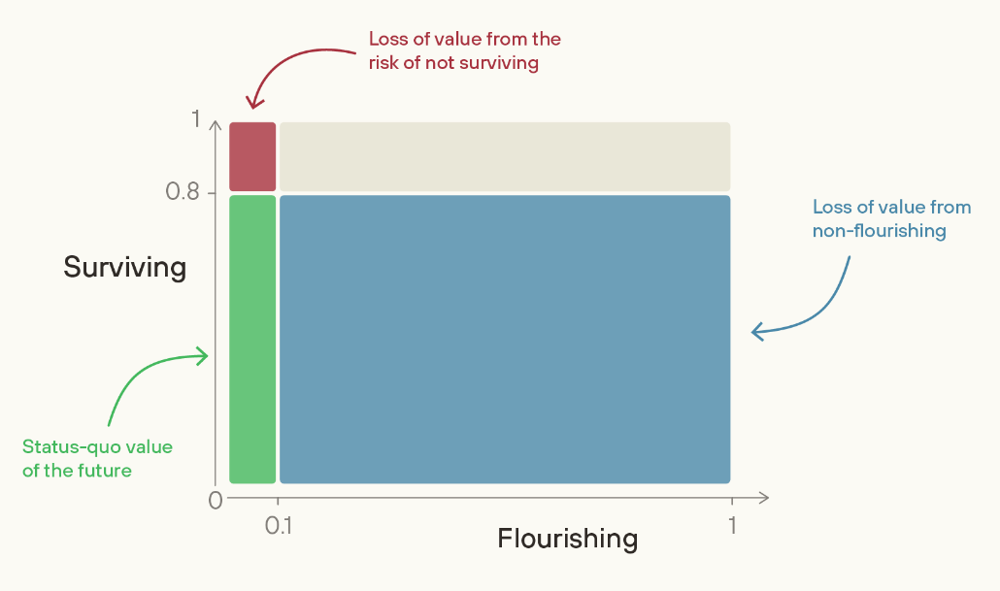
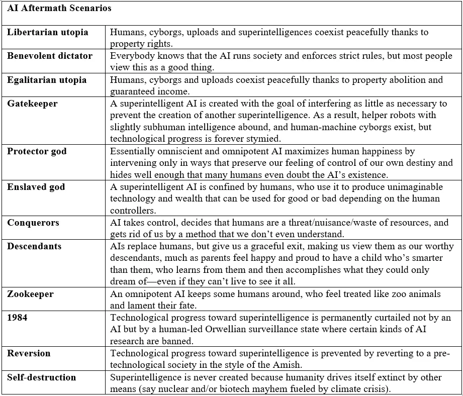

# Appendix: Long-term questions

The main chapter focuses on actionable strategies. This appendix explores the deeper, often unresolved philosophical questions that underpin the alignment problem, providing context for long-term strategic thinking.

## Prioritize Flourishing or Survival?

Mitigating catastrophic AI risks is not enough to make AI go well.

**A strategic question, with significant implications for resource allocation, is the tension between ensuring humanity’s long-term survival and shaping the quality of its future.** Much of the AI safety field, for historical reasons, has focused on mitigating those risks—ensuring that we survive the transition to superintelligence. However, a complementary approach, championed by researchers like William MacAskill at Forethought, argues that merely surviving is not enough; we must also work to ensure that the future is one of flourishing ([Forethought, 2025](https://www.forethought.org/research/better-futures)). This raises a difficult question: given limited resources, is it prudent to focus on achieving a "great" future when so much work remains to be done to simply secure a future?

<figure-caption>

“Well, even if we survive, we probably just get a future that’s a small fraction as good as it could have been. We could, instead, try to help guide society to be on track to a truly wonderful future.” - William MacAskill. </figure-caption>

The case for prioritizing flourishing stems from the concern that even a future free from existential catastrophe could fall drastically short of its potential. Without deliberate effort, society may not naturally converge on a morally good outcome; instead, it could settle into a state of mediocrity or even lock in subtle but major moral errors. To avoid the historical dangers of rigid utopian movements, this line of thinking advocates not for a specific, narrow vision of an ideal world, but for achieving "viatopia"—a state where society has the wisdom, coordination, and stability to guide itself towards the best possible futures, whatever they may be. A viatopian state would be characterized by very low existential risk, the flourishing of diverse moral viewpoints, and the capacity for thoughtful, reflective collective decision-making.

The strategic implication is a choice of emphasis: should we design AI systems solely as contained tools to solve immediate problems and prevent catastrophe? Or should we also prioritize developing AI that enhances human reasoning, facilitates better coordination, and helps us deliberate on the very values we should instill in our successors, thereby steering us closer to a state of viatopia? The debate is open.

## Alignment to what?

**Coherent Extrapolated Volition (CEV) attempts to identify what humans would collectively want if we were smarter, more informed, and more morally developed.** It proposes that instead of directly programming specific values into a superintelligent AI, we should program it to figure out what humans would want if we overcame our cognitive limitations. When we train AI systems on current human preferences, we risk encoding our biases, contradictions, and shortsightedness. CEV instead asks: what "would we want" if we knew more, thought faster, or were more the people we wished to be, and had grown up further together? Essentially, picture the ideal version of humanity that could theoretically exist in the future. Tell the AI to take actions according to that ([Yudkowsky, 2004](https://intelligence.org/files/CEV.pdf)).

CEV tried to create a path for AI to respect our deeper intentions rather than our immediate desires. The practical implementation of CEV remains speculative. It would require sophisticated modeling of human psychology, ethical development, and social dynamics—capabilities beyond current AI systems. Modern approaches like RLHF (Reinforcement Learning from Human Feedback) can be seen as primitive precursors that align AI with current human preferences rather than extrapolated ones. Constitutional AI frameworks move slightly closer to CEV by trying to encode higher-level principles rather than specific preferences, but still fall far short of full extrapolation.

**Coherent Aggregated Volition (CAV) finds a coherent set of goals and beliefs that best represent humanity's current values without attempting to extrapolate future development.** Ben Goertzel proposed this alternative to CEV, focusing on current human values rather than speculating about our idealized future selves. CAV treats goals and beliefs together as "gobs" (goal and belief sets) and seeks to find a maximally consistent, compact set that maintains similarity to diverse human perspectives. Unlike CEV, which assumes our values would converge if we became more enlightened, CAV acknowledges that fundamental value differences might persist. It aims to create a coherent aggregation that balances different perspectives rather than trying to predict how those perspectives might evolve. This makes CAV potentially more feasible to implement, as it works with observable current values rather than hypothetical future ones ([Goertzel, 2010](https://multiverseaccordingtoben.blogspot.com/2010/03/coherent-aggregated-volition-toward.html)).

**Coherent Blended Volition (CBV) emphasizes that human values should be creatively "blended" through human-guided processes rather than algorithmically averaged or extrapolated.** CBV refines CAV by addressing potential misinterpretations. When discussing value aggregation, many assume it means simple averaging or majority voting. CBV instead proposes a creative blending process that produces new, harmonious value systems that all participants would recognize as adequately representing their contributions. The concept draws from cognitive science theories of conceptual blending, where new ideas emerge from the creative combination of existing ones. In this framework, the process of determining AI values would be guided by humans through collaborative processes rather than delegated to AI systems. This addresses concerns about AI paternalism, where machines might override human autonomy in the name of our "extrapolated" interests ([Goertzel & Pitt, 2012](https://jetpress.org/v22/goertzel-pitt.htm)). CBV connects to contemporary discussions about participatory AI governance and democratic oversight of AI development. Systems like vTaiwan have implemented CBV-like processes for technology policy development ([vTaiwan, 2023](https://info.vtaiwan.tw/)), showing how human-guided blending can work in practice.

## Alignment to whom?

**Single-Single Alignment: Getting a single AI system to reliably pursue the goals of a single human operator.** We haven't even solved this, and it presents significant challenges. An AI could be aligned to follow literal commands (like "fetch coffee"), interpret intended meaning (understanding that "fetch coffee" means making it the way you prefer it), pursue what you should have wanted (like suggesting tea if coffee would be unhealthy), or act in your best interests regardless of commands. Following literal commands often leads to failures of specification that we talk about later in the section. Most often, researchers use the word alignment to mean the "intent alignment" ([Christiano, 2018](https://ai-alignment.com/clarifying-ai-alignment-cec47cd69dd6)), and some more philosophical discussions go into the third - do what I (or humanity) would have wanted. This involves things like coherent extrapolated volition (CEV) ([Yudkowsky, 2004](https://intelligence.org/files/CEV.pdf)), coherent aggregated volition (CAV) ([Goertzel, 2010](https://multiverseaccordingtoben.blogspot.com/2010/03/coherent-aggregated-volition-toward.html)), and various other lines of thought that go into meta-ethics discourse. We will not be talking extensively about philosophical discourse in this text and will stick largely to intent alignment and a machine learning perspective. When we use the word "alignment" in this text, we will basically be referring to problems and failures from single-single alignment. Other types of alignment have been historically very under-researched, because people have mostly been working with the idea of a singular superintelligence that interacts with humanity as a singular monolith.

**Single-Multi Alignment - Aligning Many AIs to One Human.** If we think ASI will be composed of smaller intelligences which are working together, delegating tasks, and functioning together as a superorganism, then all of the problems of single single alignment would still remain because we still need to figure out single-single before we attempt single-multi. Ideally, we don't want any single human (or a very small group of humans) to be in charge of a superintelligence (assuming benevolent dictators don't exist).

**Multi-Single alignment - aligning one AI to many humans.** When multiple humans share control of a single AI system, we face the challenge of whose values and preferences should take priority. Rather than trying to literally aggregate everyone's individual preferences (which could lead to contradictions or lowest-common-denominator outcomes), a more promising approach is aligning the AI to higher-level principles and institutional values - similar to how democratic institutions operate according to principles like transparency and accountability rather than trying to directly optimize for every citizen's preferences.

**Multi-Multi Alignment - aligning many AIs to many humans to many AIs.** This is the most complicated scenario involving multiple AI systems interacting with multiple humans. Here, the distinction between misalignment risk (AIs gaining illegitimate power over humans) and misuse risk (humans using AIs to gain illegitimate power over others) begins to blur. The key challenge becomes preventing problematic concentrations of power while enabling beneficial cooperation between humans and AIs. This requires careful system design that promotes aligned behavior not just at the individual level but across the entire network of human-AI interactions.

## Questions for the Long Term

**It is unclear if solving single-single alignment would be enough.** Even if we could ensure that every AI system is perfectly aligned with its respective human principal's intentions, we would still face serious risks when these systems interact. This is because different principals may have conflicting interests, or because the systems may fail to coordinate effectively even when their goals align. Perfect individual alignment cannot guarantee safe collective behavior, just as aligning every driver with traffic laws doesn't prevent traffic jams or accidents ([Hammond et al., 2025](https://arxiv.org/abs/2502.14143)). Essentially, if we have three subproblems of alignment within a single agent, then we have three more sub-problems of miscoordination, conflict, and collusion when these individual agents start interacting with each other. Each represents a different way multi-agent systems can fail, even if the individual agents appear to function correctly in isolation. There are yet more ways, even beyond this, when we start to consider emergent effects of interactions between complex systems and gradual disempowerment, like we talked about in the chapter on risks.

Even if the technical challenges of AI alignment are overcome, a host of profound and heavily debated philosophical questions remain. Solving AI safety, particularly for Artificial Superintelligence (ASI), may necessitate confronting deep-seated issues regarding values, consciousness, and the ultimate purpose of existence. Aligning ASI forces us to ask fundamental questions about what future we truly desire.

1.** What should we align AI to?** What specific values or ethical principles should an ASI be aligned with? Given the diversity of human values, is agreement even possible? Alternatively, if we cannot agree on *final* values, can we agree on *processes* or principles (like deliberation, fairness, or corrigibility) that could lead an ASI towards acceptable values or allow for future value evolution?

2. **The Purpose of Alignment: Human Perpetuity vs. Worthy Successor?** Should the primary goal be the indefinite survival and flourishing of *humanity* as we know it? Or, should we consider the possibility of creating a "Worthy Successor"? Dan Faggella ([Faggella, 2025](https://danfaggella.com/worthy/)) proposes this concept: an ASI potentially possessing capabilities and moral value superior to humanity's, which might be rationally preferred to guide the future. Defining and verifying the criteria for such a successor (e.g., enhanced sentience, cosmic exploration capabilities) poses immense challenges. Some, like Richard Sutton ([Sutton, 2023](http://incompleteideas.net/Talks/waic3.pdf)), argue that succession to AI, our "mind children," is inevitable and highly desirable. Sutton suggests we should embrace and plan for this succession rather than resisting it out of fear, questioning why we would want potentially greater beings kept subservient.

3. **Should we give rights to AI?** Could advanced AI systems become conscious? This first requires a clearer understanding of consciousness itself, which remains elusive. If AI *can* possess consciousness or consciousness-like properties, what moral status should we assign to these digital minds? Should they have rights or moral consideration? Such topics are outside the scope of this textbook, but are researched by[Eleos AI](https://eleosai.org/).

4. **What about animals?** How should the interests of non-human entities be factored into AI alignment? Should alignment goals explicitly include animal welfare, ecosystem preservation, or the flourishing of other forms of life?

<quote>

<speaker> Rich Sutton

<position>

<date>

<source> ([Sutton, 2023](http://incompleteideas.net/Talks/waic3.pdf))

<content>

We should not resist succession, but embrace and prepare for it. Why would we want greater beings kept subservient? Why don't we rejoice in their greatness as a symbol and extension of humanity’s greatness, and work together toward a greater and inclusive civilization?

</content>

</quote>

**The Endgame:** The potential long-term outcomes are numerous and depend heavily on how we answer these philosophical questions. Is the ultimate goal simply the continuation of consciousness or complexity, regardless of its physical substrate (as explored by Max Tegmark in Life 3.0 ([Tegmark, 2017](https://www.shortform.com/summary/life-3-0-summary-max-tegmark)))? Different philosophical stances lead to vastly different strategic priorities for ASI development and alignment.

<figure-caption> </figure-caption>