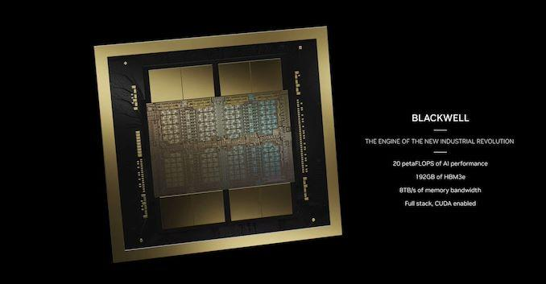
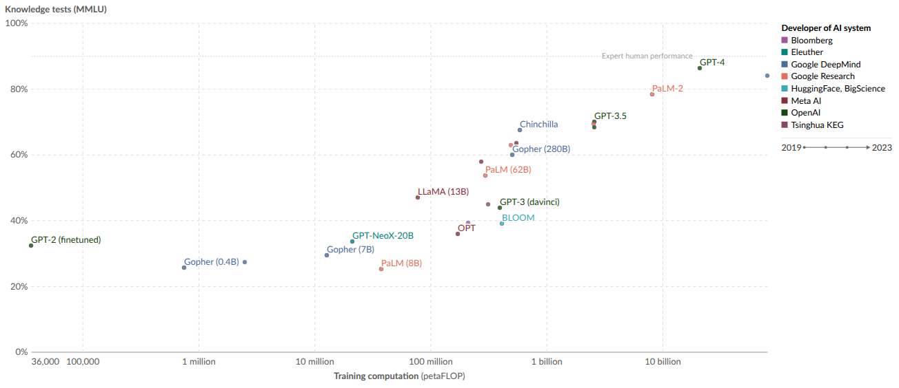
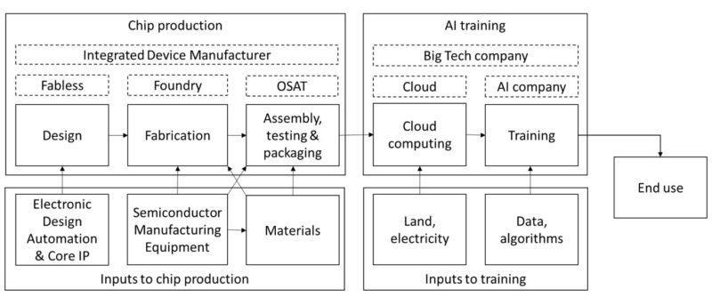
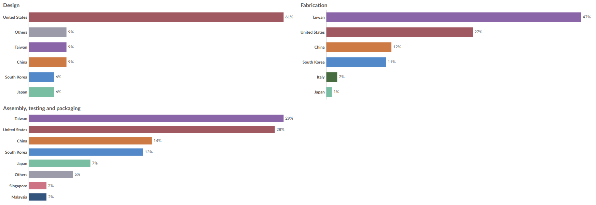
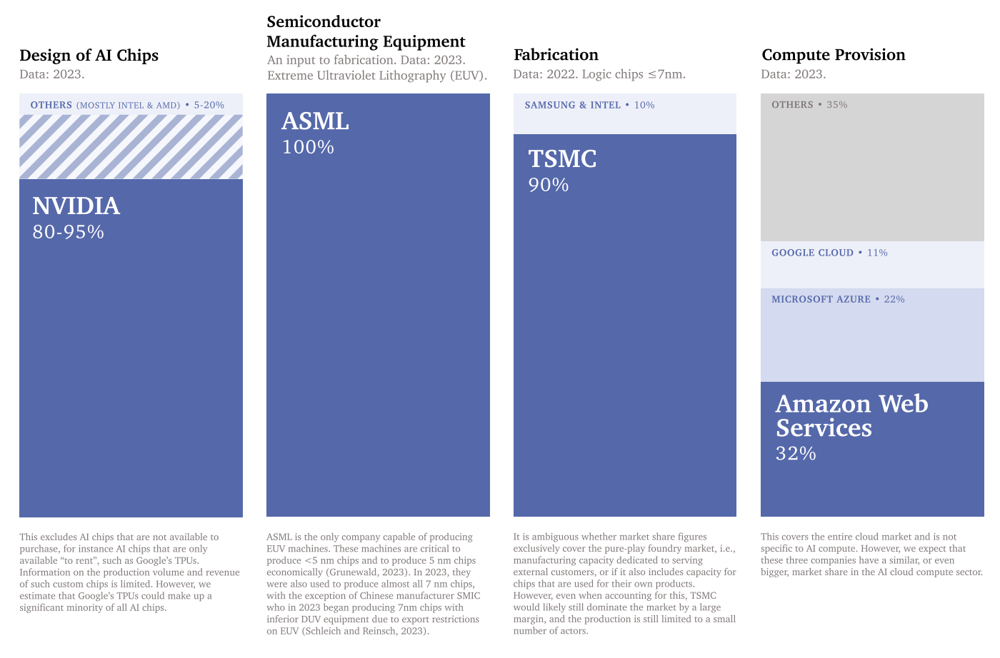
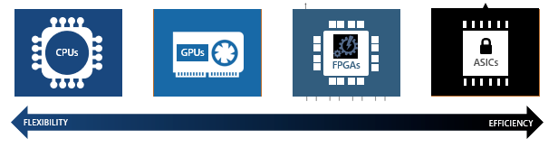
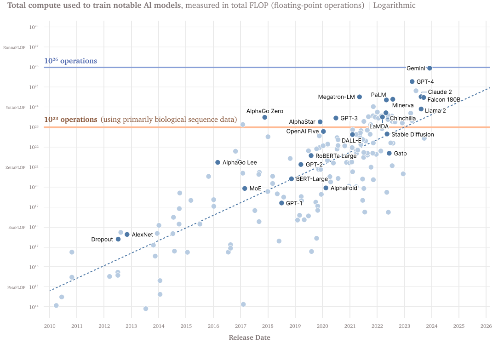
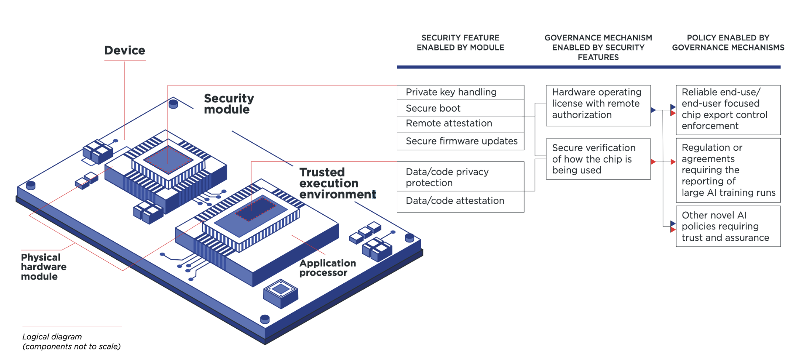

# Compute Governance

<figure-caption>

Example of an NVIDIA Blackwell B100 accelerator (2025). Each B100 carries 192 GB of HBM3e memory and delivers nearly 20 PFLOPS of FP4 throughput, roughly doubling the performance of the H100 from 2024 ([NVIDIA, 2025](https://resources.nvidia.com/en-us-blackwell-architecture)).

</figure-caption>

Compute is a powerful governance target because it meets all three criteria for effective governance targets:

- **Measurability:** Unlike data or algorithms, compute leaves clear physical footprints. Training frontier models requires massive data centers housing thousands of specialized chips ([Pilz & Heim, 2023](https://arxiv.org/abs/2311.02651)). We can track computational capacity through well-defined metrics like floating point operations (FLOPS), allowing us to identify potentially risky training runs before they begin ([Heim & Koessler, 2024](https://arxiv.org/abs/2405.10799)).

- **Controllability:** The supply chain for advanced AI chips has clear checkpoints. Only three companies dominate the current market: NVIDIA designs most AI training chips, TSMC manufactures the most advanced processors, and ASML produces the only machines capable of making cutting-edge chips. This concentration enables governance through export controls, licensing requirements, and supply chain monitoring ([Grunewald, 2023](https://www.iaps.ai/research/ai-chip-making-china); [Sastry et al., 2024](https://arxiv.org/abs/2402.08797)).

- **Meaningfulness:** As we discussed in the risks chapter, the most dangerous capabilities are likely to emerge from highly capable models, which require massive amounts of specialized computing infrastructure to train and run ([Anderljung et al., 2023](https://arxiv.org/abs/2307.03718); [Sastry et al., 2024](https://arxiv.org/abs/2402.08797)). Compute requirements directly constrain what AI systems can be built - even with cutting-edge algorithms and vast datasets, organizations cannot train frontier models without sufficient computing power ([Besiroglu et al., 2024](https://arxiv.org/abs/2401.02452)). This makes compute a particularly meaningful point of intervention, as it allows us to shape AI development before potentially dangerous systems emerge rather than trying to control them after the fact ([Heim et al., 2024](https://arxiv.org/abs/2403.08501)).

<iframe-static-figure>

</iframe-static-figure>

<iframe src="https://ourworldindata.org/grapher/ai-performance-knowledge-tests-vs-training-computation?tab=chart" loading="lazy" style="width: 100%; height: 600px; border: 0px none;" allow="web-share; clipboard-write">

</iframe>

<iframe-caption>

Performance on knowledge tests vs. training computation. Performance on knowledge tests is measured with the MMLU benchmark, here with 5-shot learning, which gauges a model’s accuracy after receiving only five examples for each task. Training computation is measured in total petaFLOP, which is 1e15 floating-point operations ([Giattino et al., 2023](https://ourworldindata.org/artificial-intelligence)).

</iframe-caption>

The discussion in the next few subsections will focus on the elements of actually implementing compute governance. We explain how concentrated supply chains enable tracking and monitoring of compute, we also give a brief discussion of hardware based on-chip compute governance mechanisms, and finally discuss some limitations based around limitations to governance based on compute thresholds, and how distributed training and open source might challenge compute governance.

<figure-caption>

Sketch of research domains for AI and Compute ([Heim, 2021](https://www.lesswrong.com/posts/G4KHuYC3pHry6yMhi)).

</figure-caption>

## Tracking

**AI-specialized chips emerge from a complex global process.** AI-specialized chips emerge from a complex global process. It starts with mining and refining raw materials like silicon and rare earth elements. These materials become silicon wafers, which are transformed into chips through hundreds of precise manufacturing steps. The process requires specialized equipment (particularly, photolithography machines from ASML) along with various chemicals, gases, and tools from other suppliers ([Grunewald, 2023](https://www.iaps.ai/research/ai-chip-making-china)).

<figure-caption>

The compute supply chain ([Belfield & Hua 2022](https://verfassungsblog.de/compute-and-antitrust/)).

</figure-caption>

**There are several chokepoints in semiconductor design and manufacturing.** The supply chain is dominated by a handful of companies at critical steps. NVIDIA designs most AI-specialized chips, TSMC manufactures the most advanced chips, and ASML produces the machines needed by TSMC to manufacture the chips ([Grunewald, 2023](https://www.iaps.ai/research/ai-chip-making-china); [Pilz et al., 2023](https://arxiv.org/abs/2311.02651)). It is estimated that NVIDIA controls around 80 percent of the market for AI training GPUs ([Jagielski, 2024](https://www.nasdaq.com/articles/nvidia-dominating-artificial-intelligence-chip-market-apple-has-been-securing-supply)). Similarly both TSMC, and ASML maintain strong leads in their respective domains ([Pilz et al., 2023](https://arxiv.org/abs/2311.02651)). Besides building the chips, the purchase and operation of them at the scale needed for frontier AI models requires massive upfront investment. In 2019, academia and governments were leading in AI supercomputers. Today, companies control over 80 percent of global AI computing capacity, while governments and academia have fallen below 20 percent ([Pilz et al., 2025](https://arxiv.org/abs/2504.16026)). Just three providers - Amazon, Microsoft, and Google - control about 65 percent of cloud computing services ([Jagielski, 2024](https://www.nasdaq.com/articles/nvidia-dominating-artificial-intelligence-chip-market-apple-has-been-securing-supply)). A small number of AI companies like OpenAI, Anthropic, and DeepMind operate their own massive GPU clusters, but even these require specialized hardware subject to supply chain controls ([Pilz & Heim, 2023](https://arxiv.org/abs/2311.02651)).

<iframe-static-figure>

</iframe-static-figure>

<iframe src="https://ourworldindata.org/grapher/market-share-logic-chip-production-manufacturing-stage?tab=chart" loading="lazy" style="width: 100%; height: 600px; border: 0px none;" allow="web-share; clipboard-write"></iframe>

<iframe-caption>

Market share for logic chip production, by manufacturing stage ([Giattino et al., 2023](https://ourworldindata.org/grapher/market-share-logic-chip-production-manufacturing-stage?tab=chart)).

</iframe-caption>

<figure-caption>

Concentration of the AI Chip Supply Chain Expressed as percentage of total market share ([Sastry et al., 2024](https://arxiv.org/abs/2402.08797)).

</figure-caption>

**Supply chain concentration creates natural intervention points.** Authorities only need to work with a small number of key players to implement controls, as demonstrated by U.S. export restrictions on advanced chips ([Heim et al., 2024](https://arxiv.org/abs/2403.08501)). It is worth keeping in mind though that this heavy concentration is also concerning. We're seeing a growing "compute divide" - while major tech companies can spend hundreds of millions on AI training, academic researchers struggle to access even basic resources ([Besiroglu et al., 2024](https://arxiv.org/abs/2401.02452)). This impacts who can participate in AI development and reduces independent oversight of frontier models. It also raises concerns around potential power concentration.

<figure-caption>

The spectrum of chip architectures with trade-offs in regards to efficiency and flexibility.

</figure-caption>

**Rather than trying to control all computing infrastructure, governance can focus specifically on specialized AI chips.** These are distinct from general-purpose hardware in both capabilities and supply chains. By targeting only the most advanced AI-specific chips, we can address catastrophic risks while leaving the broader computing ecosystem largely untouched ([Heim et al., 2024](https://arxiv.org/abs/2403.08501)). For example, U.S. export controls specifically target high-end data center GPUs while excluding consumer gaming hardware.

## Monitoring

**Training frontier AI models leaves multiple observable footprints which might allow us to detect concerning AI training runs.** The most reliable is energy consumption - training runs that might produce dangerous systems require massive power usage, often hundreds of megawatts, creating distinctive patterns ([Wasil et al., 2024](https://arxiv.org/abs/2408.16074); [Shavit, 2023](https://arxiv.org/abs/2303.11341)). Besides energy, other technical indicators include network traffic patterns characteristic of model training, hardware procurement and shipping records, cooling system requirements and thermal signatures, infrastructure buildout like power substation construction ([Sastry et al., 2024](https://arxiv.org/abs/2402.08797); [Shavit, 2023](https://arxiv.org/abs/2303.11341); [Heim et al., 2024](https://arxiv.org/abs/2403.08501)). These signals become particularly powerful when combined - sudden spikes in both energy usage and network traffic at a facility containing known AI hardware strongly suggest active model training.

**Regulations have already begun using compute thresholds to trigger oversight mechanisms.** The U.S. Executive Order on AI requires companies to notify the government about training runs exceeding $10^26$ operations - a threshold designed to capture the development of the most capable systems. The EU AI Act sets an even lower threshold of $10^25$ operations, requiring not just notification but also risk assessments and safety measures ([Heim & Koessler, 2024](https://arxiv.org/abs/2405.10799)). These thresholds help identify potentially risky development activities before they complete, enabling preventive rather than reactive governance.

<figure-caption>

Compute Thresholds as specified in the US executive order 14110 ([Sastry et al., 2024](https://arxiv.org/abs/2402.08797)).

</figure-caption>

**Cloud compute providers can play an important role in compute governance.** Most frontier AI development happens through cloud computing platforms rather than self-owned hardware. This creates natural control points for oversight, since most organizations developing advanced AI must work through these providers ([Heim et al., 2024](https://arxiv.org/abs/2403.08501)). Cloud providers' position between hardware and developers allows them to implement controls that would be difficult to enforce through hardware regulation alone. They maintain the physical infrastructure, track compute usage patterns and maintain development records. They can also monitor compliance with safety requirements, can implement access controls and respond to violations ([Heim et al., 2024](https://arxiv.org/abs/2403.08501); [Chan et al., 2024](https://arxiv.org/abs/2406.12137)). One suggested approach is "know-your-customer" (KYC) requirements similar to financial services. Providers would verify the identity and intentions of clients requesting large-scale compute resources, maintain records of significant compute usage, and report suspicious patterns ([Egan & Heim, 2023](https://arxiv.org/abs/2310.13625)). This can be done while protecting privacy - basic workload characteristics can be monitored without accessing sensitive details like model architecture or training data ([Shavit, 2023](https://arxiv.org/abs/2303.11341)). Similar KYC laws can be applied to the supply chain on purchases of state of the art AI compute hardware.

## On-Chip Controls

<figure-caption>

Current AI chips already have some components of this architecture, but not all. These gaps likely could be closed with moderate development effort as extensions of functionality already in place ([Aarne et al., 2024](https://www.iaps.ai/research/secure-governable-chips)).

</figure-caption>

**Beyond monitoring and detection, compute infrastructure can include active control mechanisms built directly into the processor hardware.** Similar to how modern smartphones and computers include secure elements for privacy and security, AI chips can incorporate features that verify and control how they're used. These features could prevent unauthorized training runs or ensure chips are only used in approved facilities ([Aarne et al., 2024](https://www.iaps.ai/research/secure-governable-chips)). The verification happens at the hardware level, making it much harder to bypass than software controls.

**On-chip controls could enable methods like usage limits, logging, and location verification.** Several approaches show promise. Usage limits could cap the amount of compute used for certain types of AI workloads without special authorization. Secure logging systems could create tamper-resistant records of how chips are used. Location verification could ensure chips are only used in approved facilities ([Brass & Aarne, 2024](https://www.iaps.ai/research/location-verification-for-ai-chips)). Hardware could even include "safety interlocks" that automatically pause training if certain conditions aren't met. Ideas like this are also called on-chip governance ([Aarne et al., 2024](https://www.iaps.ai/research/secure-governable-chips)). We already see similar concepts in cybersecurity, with features like Intel's Software Guard Extensions, or trusted platform modules (TPM) ([Intel, 2024](https://www.intel.com/content/www/us/en/business/enterprise-computers/resources/trusted-platform-module.html)) providing hardware-level security guarantees. While we're still far from equivalent safeguards for AI compute, early research shows promising directions ([Shavit, 2023](https://arxiv.org/abs/2303.11341)). Some chips already include basic monitoring capabilities that could be expanded for governance purposes ([Petrie et al., 2024](https://arxiv.org/abs/2404.18308)).

## Limitations

**While the trend over the last decade has involved more compute this might not last forever.** We spoke at length about scaling laws in previous chapters. Research suggests continued model scaling is still possible through 2030 ([Sevilla et al., 2024](https://epoch.ai/blog/can-ai-scaling-continue-through-2030)) algorithmic improvements continuously enhance efficiency, meaning the same compute achieves more capability over time. Smaller models could begin to show comparable capabilities and risks. For example, Falcon 180B is outperformed by far smaller models like Llama-3 8B. This makes static compute thresholds less reliable as capability indicators without regular updates ([Hooker, 2024](https://arxiv.org/abs/2407.05694)). Moreover, 'inference-time compute' trends (e.g. OpenAI o3, DeepSeek r1), and methods like model distillation can dramatically improve model capabilities without changing the amount of compute used to train a model. Current governance frameworks do not account for these post-training enhancements ([Shavit, 2023](https://arxiv.org/abs/2303.11341)).

<figure-caption>

Estimates of the scale constraints imposed by the most important bottlenecks to scale. Each estimate is based on historical projections. The dark shaded box corresponds to an interquartile range and light shaded region to an 80 percent confidence interval. The four boxes showcase four constraints that might slow down growth in the future: power, chips (compute), data and latency ([Sevilla et al., 2024](https://epoch.ai/blog/can-ai-scaling-continue-through-2030)).

</figure-caption>

**Smaller more specialized models might still cause risks.** Different domains have very different compute requirements. Highly specialized models trained on specific datasets might develop dangerous capabilities while using relatively modest compute. For example, models focused on biological or cybersecurity domains could pose serious risks even with compute usage below typical regulatory thresholds ([Mouton et al., 2024](https://www.rand.org/pubs/research_reports/RRA2977-1.html); [Heim & Koessler, 2024](https://arxiv.org/abs/2405.10799)).

**While compute governance can help manage AI risks, overly restrictive controls could have negative consequences.** Right now, only a handful of organizations can afford the compute needed for frontier AI development. ([Purtova et al., 2022](https://arxiv.org/abs/2212.10244); [Pilz et al., 2023](https://arxiv.org/abs/2311.02651)). Adding more barriers could worsen this disparity, concentrating power in a few large tech companies and reducing independent oversight ([Besiroglu et al., 2024](https://arxiv.org/abs/2401.02452)). Academic researchers already struggle to access the compute they need for meaningful AI research. As models get larger and more compute-intensive, this gap between industry and academia grows wider. ([Besiroglu et al., 2024](https://arxiv.org/abs/2401.02452); [Zhang et al., 2021](https://arxiv.org/abs/2104.07237)) Large compute clusters have many legitimate uses beyond AI development, from scientific research to business applications. Overly broad restrictions could hinder beneficial innovation. Additionally, once models are trained, they can often be run for inference using much less compute than training required. This makes it challenging to control how existing models are used without imposing overly restrictive controls on general computing infrastructure ([Sastry et al., 2024](https://arxiv.org/abs/2402.08797)).

**Distributed training and inference approaches could bypass compute governance controls.** Currently, training frontier models requires concentrating massive compute resources in single locations due to communication requirements between chips. Decentralized or distributed training methods have not really caught up to centralized methods ([Douillard et al., 2023](https://arxiv.org/abs/2311.08105); [Jaghouar et al., 2024](https://arxiv.org/abs/2407.07852)). However, if we see fundamental advances in distributed training algorithms this could eventually allow training to be split across multiple smaller facilities. While this remains technically challenging and inefficient, it could make detection and control of dangerous training runs more difficult ([Anderljung et al., 2023](https://arxiv.org/abs/2307.03718)).

Given these limitations, compute monitoring and thresholds should primarily operate as an initial screening mechanism to identify models warranting further scrutiny, rather than as the sole determinant of specific regulatory requirements. They are most effective when used to trigger oversight mechanisms such as notification requirements and risk assessments, whose results can then inform appropriate mitigation measures.