# Governance Architectures

The governance of frontier AI cannot be entrusted to any single institution or level of authority. Companies lack incentives to fully account for societal impacts, nations compete for technological advantage, and international bodies struggle with capacity for enforcement. Each level of governance – corporate, national, and international — brings unique strengths and faces distinct limitations. Understanding how these levels interact and reinforce each other is important for building effective AI governance systems.

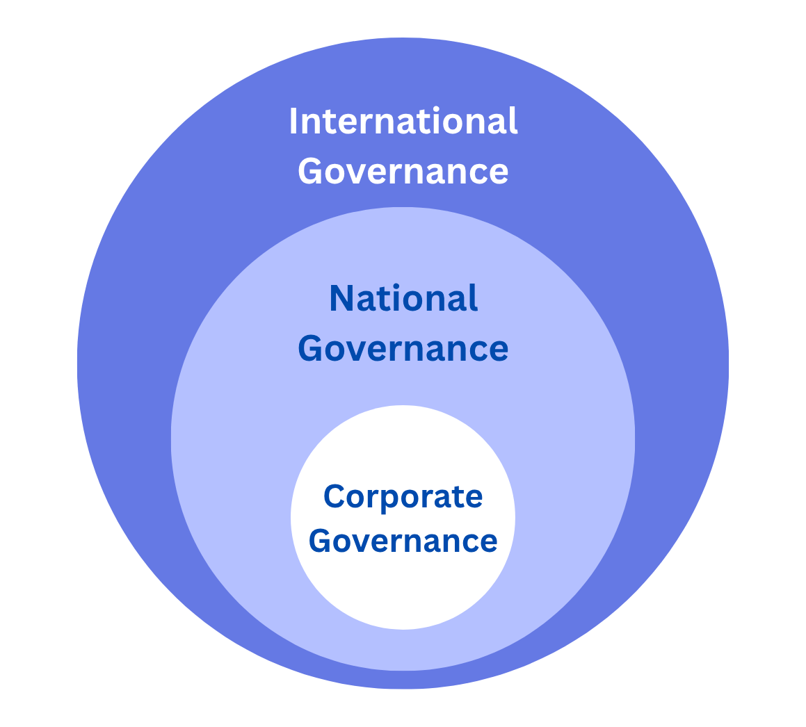

<figure-caption>

The three levels of AI governance.

</figure-caption>

**Corporate governance provides speed and technical expertise.** Companies developing frontier AI have unmatched visibility into emerging capabilities and can implement safety measures faster than any external regulator. They control critical decision points: architecture design, training protocols, capability evaluations, and deployment criteria. When OpenAI discovered that GPT-4 could engage in deceptive behavior, they could immediately modify training procedures - something that would take months or years through regulatory channels ([Koessler, 2023](https://www.governance.ai/research-paper/risk-assessment-at-agi-companies-a-review-of-popular-risk-assessment-techniques-from-other-safety-critical-industries)).

**National governance establishes democratic legitimacy and enforcement power.** While companies can act quickly, they lack the authority to make decisions affecting entire populations. National governments provide the democratic mandate and enforcement mechanisms necessary for binding regulations. The EU AI Act demonstrates this by establishing legal requirements backed by fines up to 3% of global revenue, creating real consequences for non-compliance that voluntary corporate measures cannot match ([Schuett et al., 2024](https://www.governance.ai/research-paper/from-principles-to-rules-a-regulatory-approach-for-frontier-ai)).

**International governance addresses global externalities and coordination failures.** AI risks don't respect borders. A dangerous model developed in one country can affect the entire world through digital proliferation. International mechanisms help align incentives between nations, preventing races to the bottom and ensuring consistent safety standards. The International Network of AI Safety Institutes, launched in 2024, exemplifies how countries can share best practices and coordinate standards despite competitive pressures ([Ho et al., 2023](https://www.ceris.be/wp-content/uploads/2024/03/International-Institutions-for-Advanced-AI-Robert-Trager.pdf)).

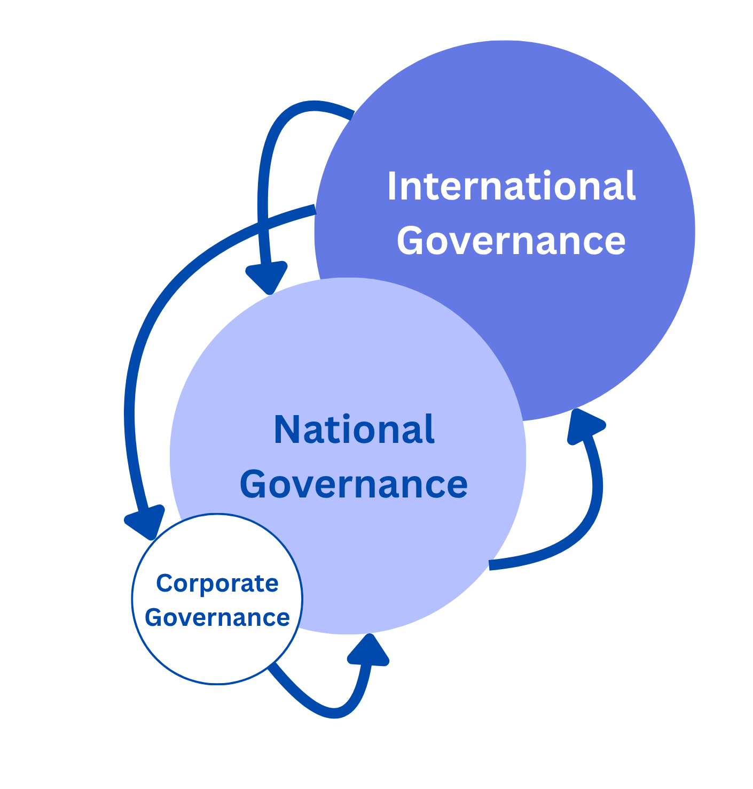

<figure-caption>

How the levels interact and reinforce.

</figure-caption>

**Governance levels create reinforcing feedback loops.** Corporate safety frameworks inform national regulations, which shape international standards, which in turn influence corporate practices globally. When Anthropic introduced its Responsible Scaling Policy in 2023, it provided a template that influenced both the U.S. Executive Order's compute thresholds and discussions at international AI summits. This cross-pollination accelerates the development of effective governance approaches ([Schuett, 2023](https://www.governance.ai/research-paper/three-lines-of-defense-against-risks-from-ai#:~:text=Organizations%20that%20develop%20and%20deploy,%2C%20legal%2C%20and%20ethical%20reasons.)).

**Gaps at one level create pressure at others.** When corporate self-governance proves insufficient, pressure builds for national regulation. When national approaches diverge too sharply, creating regulatory arbitrage, demand grows for international coordination. This dynamic tension drives governance evolution, though it can also create dangerous gaps during transition periods.

**Different levels handle different timescales and uncertainties.** Corporate governance excels at rapid response to technical developments but struggles with long-term planning under competitive pressure. National governance can establish stable frameworks but moves slowly. International governance provides long-term coordination but faces the greatest implementation challenges. Together, they create a temporal portfolio addressing both immediate and systemic risks.

## Corporate Governance

<quote>

<speaker> Elon Musk

<position> Founder/Co-Founder of OpenAI, Neuralink, SpaceX, xAI, PayPal, CEO of Tesla, CTO of X/Twitter

<date>

<source>

<content>

AI is a rare case where I think we need to be proactive in regulation than be reactive [...] I think that [digital super intelligence] is the single biggest existential crisis that we face and the most pressing one. It needs to be a public body that has insight and then oversight to confirm that everyone is developing AI safely [...] And mark my words, AI is far more dangerous than nukes. Far. So why do we have no regulatory oversight? This is insane.

</content>

</quote>

<quote>

<speaker> Dario Amodei

<position> Co-Founder/CEO of Anthropic, ex-president of research at OpenAI

<date>

<source>

<content>

Almost every decision I make feels like it’s balanced on the edge of a knife. If we don’t build fast enough, authoritarian countries could win. If we build too fast, the kinds of risks we’ve written about could prevail.

</content>

</quote>

In this section we'll examine how AI companies approach governance in practice. We'll look at what works, what doesn't, and where gaps remain. This will help us understand why corporate governance alone isn't enough, and set the scene for later discussions of national and international governance. By the end of this section, we'll establish both the essential role of company-level governance and why it needs to be complemented by broader regulatory frameworks.

**What is corporate governance and why does it matter?** Corporate governance refers to the internal structures, practices, and processes that determine how AI companies make safety-relevant decisions. Companies developing frontier AI have unique visibility into emerging capabilities and can implement safety measures faster than external regulators ([(Anderljung et al., 2023)](http://arxiv.org/abs/2307.03718); [Sastry et al., 2024](https://arxiv.org/abs/2402.08797))). They have the technical knowledge and direct control needed to implement effective safeguards, but they also face immense market pressures that can push against taking time for safety measures ([Friedman et al., 2007](https://doi.org/10.1007/978-3-540-70818-6_14)). It includes policies, oversight structures, technical protocols, and organizational norms that companies use to ensure safety throughout the AI development process. These mechanisms translate high-level principles into operational decisions within labs and development teams ([Zhang et al., 2021](https://arxiv.org/abs/2105.02117); [Cihon et al., 2021](https://arxiv.org/abs/2012.06505)).

Internal governance mechanisms matter because frontier AI companies currently have significant freedom in governing their own systems. Their proximity to development allows them to identify and address risks earlier and more effectively than external oversight alone could achieve ([Zhang et al., 2021](https://arxiv.org/abs/2105.02117)). However, internal governance alone cannot address systemic risks; these require public oversight, which we explore later in this chapter.

<iframe-static-figure>

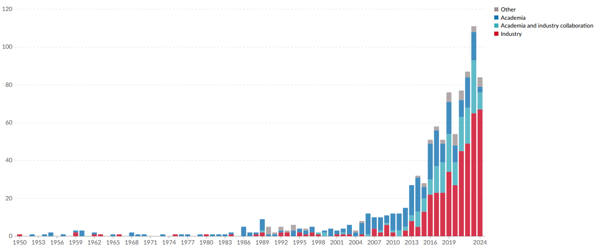

</iframe-static-figure>

<iframe src="https://ourworldindata.org/grapher/affiliation-researchers-building-artificial-intelligence-systems-all?tab=chart" loading="lazy" style="width: 100%; height: 600px; border: 0px none;" allow="web-share; clipboard-write"></iframe>

<iframe-caption>

Affiliation of research teams building notable AI systems, by year of publication. Describes the sector where the authors of a notable AI system have their primary affiliations ([Giattino et al., 2023](https://ourworldindata.org/artificial-intelligence)).

</iframe-caption>

**Why does internal governance matter in practice?** AI companies control the most sensitive stages of model development: architecture design, training runs, capability evaluations, deployment criteria, and safety protocols. Well-designed internal governance can reduce risks by aligning safety priorities with day-to-day decision-making, embedding escalation procedures, and enforcing constraints before deployment ([Hendrycks et al., 2024](https://www.aisafetybook.com/textbook/corporate-governance)). It includes proactive measures like pausing training runs, restricting access to high-risk capabilities, and auditing internal model use. Because external actors often lack access to proprietary information, internal governance is the first line of defense, especially for models that have not yet been released ([Schuett, 2023](https://arxiv.org/abs/2212.08364); [Cihon et al., 2021](https://arxiv.org/abs/2012.06505)).

<quote>

<speaker> International AI Safety Report

<position>

<date>

<source> ([Bengio et al. 2025](https://arxiv.org/abs/2501.17805))

<content>

Deployment can take several forms: internal deployment for use by the system's developer, or external deployment either publicly or to private customers. Very little is publicly known about internal deployments. However, companies are known to adopt different types of strategies for external deployment.

</content>

</quote>

**What role does internal deployment play in internal governance?** The most advanced AI systems are typically first deployed internally within AI companies before any public release. These internal deployments often lack the scrutiny applied to external launches and may operate with elevated privileges, bypass formal evaluations, and evolve capabilities through iterative use before external stakeholders are even aware of their existence ([Stix, 2025](https://arxiv.org/abs/2504.12170)). Without policies that explicitly cover internal use, such as access controls, internal deployment approvals, or safeguards against recursive model use, high-risk systems may advance unchecked (See Figure B.). Yet public knowledge of these deployments are limited, and most governance efforts still focus on public-facing releases ([Bengio et al., 2025](https://assets.publishing.service.gov.uk/media/679a0c48a77d250007d313ee/International_AI_Safety_Report_2025_accessible_f.pdf)). Strengthening internal governance around internal deployment is critical to ensure that early and potentially hazardous use cases are properly supervised.

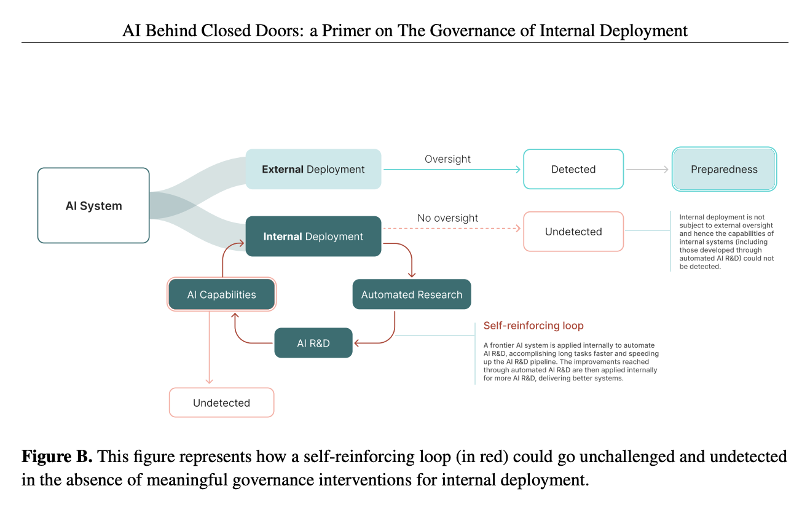

<figure-caption>

The figure illustrates a self-reinforcing loop in which AI systems progressively automate AI research, leading to increasingly capable AI that further accelerates its own development ([Stix, 2025](https://arxiv.org/abs/2504.12170)).

</figure-caption>

Organizational structures establish who makes decisions and who is responsible for safety in AI companies. Later sections cover specific safety mechanisms, here, we focus on the governance question: who has the authority within companies to prioritize safety over other goals?

For instance, an effective governance structure determines whether a safety team can delay a model release if they identify concerns, whether executives can override safety decisions, and whether the board has final authority over high-risk deployments. These authority relationships directly affect how safety considerations factor into development decisions.

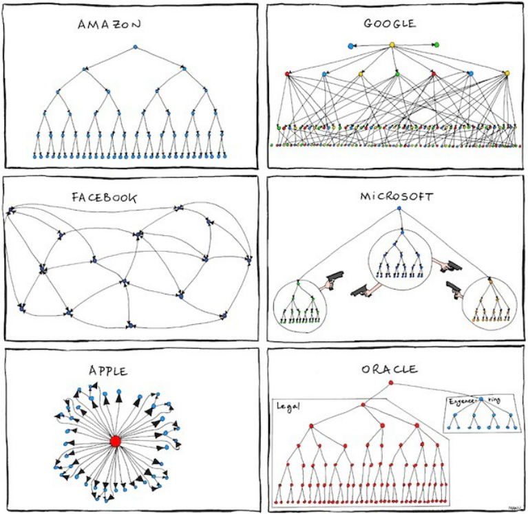

<figure-caption>

([Kahney, 2011](https://www.cultofmac.com/news/apple-ms-google-etc-imagined-as-fun-org-charts))

</figure-caption>

**What governance roles are critical for AI safety?** Effective AI governance requires three interconnected levels of internal oversight ([Hadley et al., 2024](https://arxiv.org/abs/2402.01691); [Schuett, 2023](https://www.governance.ai/research-paper/three-lines-of-defense-against-risks-from-ai#:~:text=Organizations%20that%20develop%20and%20deploy,%2C%20legal%2C%20and%20ethical%20reasons.)):

- Board-level oversight structures allocating resources and enforcing safety policies such as Algorithm Review Boards (ARBs) and ethics boards for technical and societal risk assessments, guiding go/no‐go decisions on deployments, and establishing oversight with clear lines of accountability ([Hadley et al., 2024](https://arxiv.org/abs/2402.01691); [Schuett, 2023](https://www.governance.ai/research-paper/three-lines-of-defense-against-risks-from-ai#:~:text=Organizations%20that%20develop%20and%20deploy,%2C%20legal%2C%20and%20ethical%20reasons.)).

- Executives allocating resources and enforcing safety policies. Roles like the Chief Artificial Intelligence Officer (CAIO), Chief Risk Officer (CRO), and related positions to coordinate risk management efforts across the organization, and help translate ethical principles into practice ([Schäfer et al., 2022](https://www.researchgate.net/publication/360644155_AI_GOVERNANCE_ARE_CHIEF_AI_OFFICERS_AND_AI_RISK_OFFICERS_NEEDED); [Janssen et al., 2025](https://academic.oup.com/policyandsociety/article/44/1/38/7965776)).

- Technical safety teams conducting evaluations and recommending mitigations. Teams comprising internal auditors, risk officers, and specialized audit committees for ensuring rigorous risk identification, maintaining audit integrity, and providing operational assurance, with direct reporting lines to the board for independence ([Schuett, 2023](https://www.governance.ai/research-paper/three-lines-of-defense-against-risks-from-ai#:~:text=Organizations%20that%20develop%20and%20deploy,%2C%20legal%2C%20and%20ethical%20reasons.); [Raji et al., 2020](https://dl.acm.org/doi/pdf/10.1145/3351095.3372873)).

**In May 2025, OpenAI announced a significant restructuring of its governance model.** While maintaining nonprofit control, the company transitioned its for-profit subsidiary from an LLC to a Public Benefit Corporation (PBC): the same model used by Anthropic and other AI labs. This change represented an acknowledgment that earlier "capped-profit" structures were designed for "a world where there might be one dominant AGI effort" but were less suitable "in a world of many great AGI companies" ([OpenAI, 2025](https://openai.com/index/evolving-our-structure/)). Frontier AI companies must simultaneously secure billions in capital investment, maintain competitiveness with well-resourced rivals, and preserve governance structures that prioritize safety. As Daniel Colson of the AI Policy Institute notes, this creates difficult tradeoffs where boards might be forced to "weigh total collapse against some form of compromise in order to achieve what it sees as its long-term mission" ([TIME, 2024](https://time.com/6983420/anthropic-structure-openai-incentives/)).

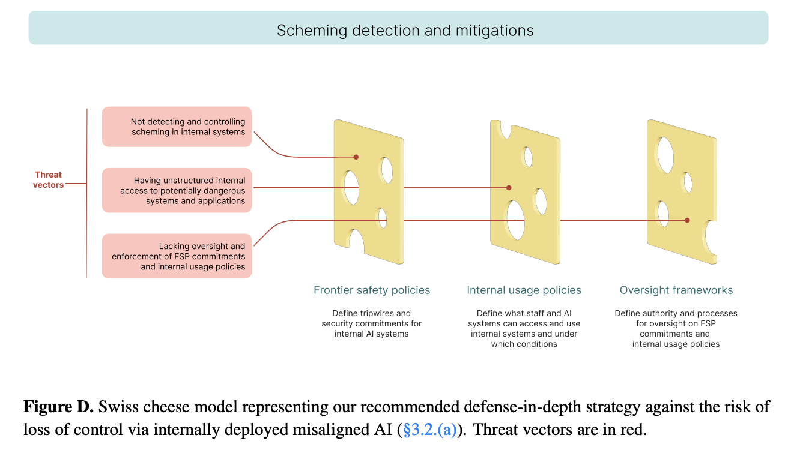

<figure-caption>

([Stix, 2025](https://arxiv.org/abs/2504.12170))

</figure-caption>

### Frontier Safety Frameworks

Frontier Safety Frameworks are internal policies that AI companies create to guide their development process and ensure they're taking appropriate precautions as their systems become more capable. They're the equivalent of the safety protocols used in nuclear power plants or high-security laboratories, and help bridge internal corporate governance mechanisms and external regulatory oversight in AI safety.

First introduced in 2023, FSFs gained momentum during the Seoul AI Summit in May 2024, where 16 companies committed to implementing such policies. As of March 2025, twelve companies have published comprehensive frontier AI safety policies: Anthropic, OpenAI, Google DeepMind, Magic, Naver, Meta, G42, Cohere, Microsoft, Amazon, xAI, and Nvidia, with additional companies following suit ([METR, 2025](https://metr.org/blog/2025-03-26-common-elements-of-frontier-ai-safety-policies/)).

**What essential elements define a comprehensive FSF?** Despite variations in implementation, most FSFs share several fundamental elements:

- **Capability Thresholds:** FSFs establish specific thresholds at which AI capabilities would pose severe risks requiring enhanced safeguards ([Nevo et al., 2024](https://www.rand.org/pubs/research_reports/RRA2849-1.html)). Common capability concerns include: Biological weapons assistance (such as enabling the creation of dangerous pathogens), Cyber Offensive capabilities (such as automating zero-day exploit discovery), Automated AI research and development (such as accelerating AI progress beyond human oversight), Autonomous replication and adaptation.

- **Model Weight Security:** As models approach dangerous capability thresholds, companies implement increasingly sophisticated security measures to prevent unauthorized access to model weights. These range from standard information security protocols to advanced measures like restricted access environments, encryption, and specialized hardware security ([Nevo et al., 2024](https://www.rand.org/pubs/research_reports/RRA2849-1.html)).

- **Conditions for Halting Development/Deployment:** Most frameworks contain explicit commitments to pause model development or deployment if capability thresholds are crossed before adequate safeguards can be implemented ([METR, 2025](https://metr.org/blog/2025-03-26-common-elements-of-frontier-ai-safety-policies/)).

- **Full Capability Elicitation:** Through FSFs, companies commit to evaluating models in ways that reveal their full capabilities rather than underestimating them ([Phuong et al., 2024](https://arxiv.org/abs/2403.13793)).

- **Evaluation Frequency and Timing:** FSFs establish specific timelines for when evaluations must occur (typically before deployment, during training, and after deployment) with triggers for additional assessments when models show significant capability increases ([Davidson et al., 2023](https://arxiv.org/abs/2312.07413)).

- **Accountability Mechanisms:** These include: Internal governance roles (for example, Anthropic's "Responsible Scaling Officer"), External advisory boards and third-party audits, Transparency commitments about model capabilities and safety measures, Whistleblower protections for staff reporting safety concerns.

- **Policy Updates:** All FSFs acknowledge the evolving nature of AI risks and commit to regular policy reviews and updates as understanding of risks and best practices improve ([METR, 2025](https://metr.org/blog/2025-03-26-common-elements-of-frontier-ai-safety-policies/)).

**How do companies operationalize safety frameworks in practice?** One promising approach gaining traction is the Three Lines of Defense (3LoD) model adapted from other safety-critical industries ([Schuett, 2023](https://arxiv.org/abs/2212.08364)):

- **First Line of Defense:** Frontline researchers and developers implement safety measures in day-to-day work, conduct initial risk assessments, and adhere to ethical guidelines and safety protocols.

- **Second Line of Defense:** Specialized risk management and compliance functions, including AI ethics committees, dedicated safety teams, and compliance units provide oversight and guidance.

- **Third Line of Defense:** Independent internal audit functions provide assurance to board and senior management through regular audits of safety practices, independent model evaluations, and assessments of overall preparedness.

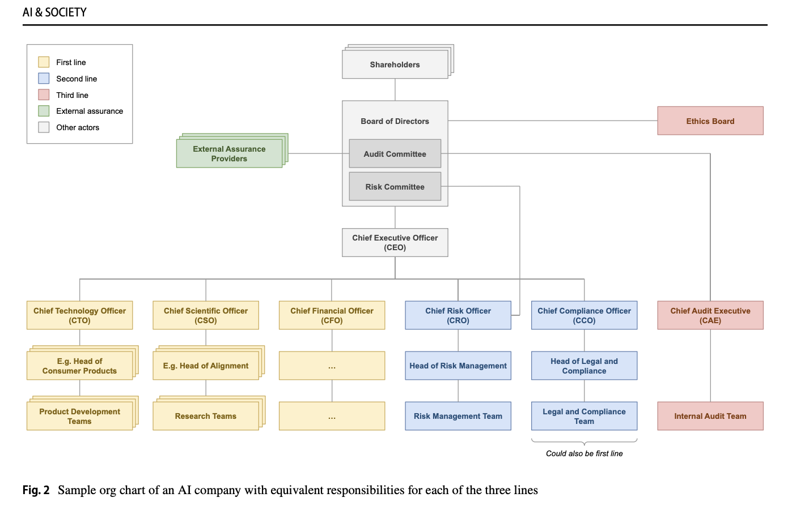

<figure-caption>

Sample org chart of an AI company with equivalent responsibilities for each of the three lines.

</figure-caption>

This multi-layered approach helps ensure risks are identified and managed at multiple levels, reducing the chances of dangerous oversights. For instance, when researchers develop a model with unexpectedly advanced capabilities, safety teams can conduct thorough evaluations and implement additional safeguards, while audit teams review broader processes for managing emergent capabilities ([Schuett, 2023](https://arxiv.org/abs/2212.08364)).

**How do you assess risks for capabilities that don't yet exist?** AI capabilities are fast-growing and changing. FSFs incorporate techniques from other safety-critical industries adapted to AI development ([Koessler & Schuett, 2023](https://arxiv.org/abs/2307.08823)):

- **Scenario Analysis:** Exploring potential future scenarios, like an AI system developing deceptive behaviors or unexpected emergent capabilities.

- **Fishbone Analysis:** Identifying potential causes of alignment failures, such as insufficient safety research, deployment pressure, or inadequate testing.

- **Causal Mapping:** Visualizing how research decisions, safety measures, and deployment strategies interact to influence overall risk.

- **Delphi Technique:** Gathering expert opinions through structured rounds of questionnaires to synthesize diverse perspectives on potential risks.

- **Bow Tie Analysis:** Mapping pathways between causes, hazardous events, and consequences, along with prevention and mitigation measures.

**What happens when pre-deployment safeguards are insufficient?** Even with rigorous pre-deployment safeguards, dangerous capabilities may emerge after deployment. FSFs increasingly incorporate "deployment corrections", which are comprehensive contingency plans for scenarios where pre-deployment risk management falls short ([O'Brien et al., 2023](https://arxiv.org/pdf/2310.00328)):

- Technical Controls for maintaining continuous control over deployed models through monitoring and modification capabilities, supported by pre-built rollback mechanisms.

- Organizational Preparedness for establishing dedicated incident response teams trained in rapid risk assessment and mitigation.

- Legal Framework for creating clear user agreements that establish the operational framework for emergency interventions.

- Model shutdown such as full market removal or the destruction of the model and associated components.

**What benefits do FSFs provide, and where do they fall short?** FSFs give companies a way to demonstrate their commitment to proactive risk management. Their public nature enables external scrutiny, while their risk categorization frameworks show engagement with potential failure modes. The frameworks' deliberately flexible structure allows adaptation as understanding of AI risks evolves ([Pistillo, 2025](https://arxiv.org/abs/2501.16500)).

**How can we ensure FSFs are effectively implemented?** While FSFs represent progress in AI governance, their effectiveness ultimately depends on implementation. Companies like Anthropic and OpenAI have established notable governance mechanisms. No matter how well-designed, internal policies remain subject to companies' strategic interests. When safety competes with speed, profitability, or market dominance, even strong internal governance may be compromised. Voluntary measures lack enforceability, and insiders often face misaligned incentives when raising concerns ([Zhang et al., 2025](https://papers.ssrn.com/sol3/papers.cfm?abstract_id=5241351)).

**Limitations and Path Forward**

<quote>

<speaker> Demis Hassabis

<position> CEO and Co-Founder of DeepMind, Nobel Prize Laureate in Chemistry

<date>

<source>

<content>

These kinds of decisions are too big for any one person. We need to build more robust governing structures that don’t put this in the hands of just a few people.

</content>

</quote>

As AI capabilities continue to advance, governance frameworks must evolve accordingly. There is still significant room for improvement. Some suggest that companies should define more precise, verifiable risk thresholds, potentially drawing on societal risk tolerances from other industries ([Pistillo, 2025](https://arxiv.org/pdf/2501.16500)). For instance, industries dealing with catastrophic risks typically set maximum tolerable risk levels ranging from 1 in 10,000 to 1 in 10 billion per year - quantitative thresholds that AI companies might adopt with appropriate adjustments.

For systemic risks like race dynamics, dual-use misuse, or catastrophic model failure, no single company can be trusted to serve the public interest alone. Corporate governance can buy time but cannot substitute for public accountability or system-wide safety architecture. In the next chapter, we examine how national governance frameworks can provide this essential external oversight, establishing regulatory boundaries that apply across all companies within jurisdictions.

## National Governance

<quote>

<speaker> Zhang Jun

<position> China's UN Ambassador

<date>

<source>

<content>

The potential impact of AI might exceed human cognitive boundaries. To ensure that this technology always benefits humanity, we must regulate the development of AI and prevent this technology from turning into a runaway wild horse [...] We need to strengthen the detection and evaluation of the entire lifecycle of AI, ensuring that mankind has the ability to press the pause button at critical moments.

</content>

</quote>

We established in the previous section that companies can often lack incentives to fully account for the broader societal impact, face competitive pressures that may compromise safety, and lack the legitimacy to make decisions affecting entire populations ([Dafoe, 2023](https://arxiv.org/abs/2307.04699)). National governance frameworks therefore serve as an essential complement to self-regulatory initiatives, setting regional standards that companies can incorporate into their internal practices.

Unlike traditional technological governance challenges, frontier AI systems generate externalities that span multiple domains: from national security to economic stability, from social equity to democratic functioning. AI systems threaten national security by democratizing capabilities usable by malicious actors, facilitate unequal economic outcomes by concentrating market power in specific companies and countries while displacing jobs elsewhere, and produce harmful societal conditions through extractive data practices and biased algorithmic outputs ([Roberts et al., 2024](https://academic.oup.com/ia/article/100/3/1275/7641064)). Traditional regulatory bodies, designed for narrower technological domains, typically lack the necessary spatial remit, technical competence, or institutional authority to effectively govern these systems ([Dafoe, 2023](https://arxiv.org/abs/2307.04699)).

Consider the contrast with self-driving vehicles, where the primary externalities are relatively well-defined (safety of road users) and fall within existing regulatory frameworks (traffic safety agencies). Frontier AI systems, by contrast, generate externalities that cross traditional regulatory boundaries and jurisdictions, requiring new institutional approaches that can address the expertise gap, coordination gap, and temporal gap in current regulatory frameworks [(Dafoe, 2023](https://arxiv.org/abs/2307.04699)).

**AI systems can cause harm in ways that are not always transparent or predictable.** Beyond software bugs or input-output mismatches, risks emerge from how AI systems internally represent goals, make trade-offs, and generalize from data. When these systems are deployed at scale, even subtle misalignments between system behavior and human intent can have widespread consequences. Automated subgoal pursuit, for example, can generate outcomes that are technically correct but socially catastrophic if not carefully constrained ([Cha, 2024](https://www.nature.com/articles/s41599-024-03017-1)). Because many of these failure modes are embedded in opaque model architectures and training dynamics, they resist detection through conventional auditing or certification processes. National regulation provides an anchor for accountability by requiring developers to build, test, and deploy systems in ways that are externally verifiable, legally enforceable, and publicly legitimate.

As we will see in this section, major regions have developed distinctly different regulatory philosophies that reflect their unique institutional contexts and political priorities. Understanding these national frameworks will provide context for our subsequent analysis of international governance mechanisms, which must navigate and harmonize these regional differences to create effective global standards for AI systems whose impacts transcend national borders.

Across the last decade, over 30 countries have released national AI strategies outlining their approach to development, regulation, and adoption. These strategies differ widely in emphasis, but when systematically analyzed, they fall into three recurring governance patterns: development, control, and promotion ([Papyshev et al., 2023](https://www.researchgate.net/publication/367010605_The_state's_role_in_governing_artificial_intelligence_development_control_and_promotion_through_national_strategies)). In development-led models, such as those in China, South Korea, and Hungary, the state acts as a strategic coordinator, directing public resources toward AI infrastructure, research programs, and national missions. Control-oriented approaches, prominent in the European Union and countries like Norway and Mexico, emphasize legal standards, ethics oversight, and risk monitoring frameworks. Promotion-focused models, including the United States, United Kingdom, and Singapore, adopt a more decentralized approach: the state acts primarily as an enabler of private sector innovation, with relatively few regulatory constraints. These differences matter. Any attempt to build international governance frameworks will need to account for the structural asymmetries between these national regimes, particularly around enforcement authority, accountability mechanisms, and institutional capacity ([Papyshev et al., 2023](https://www.researchgate.net/publication/367010605_The_state's_role_in_governing_artificial_intelligence_development_control_and_promotion_through_national_strategies)).

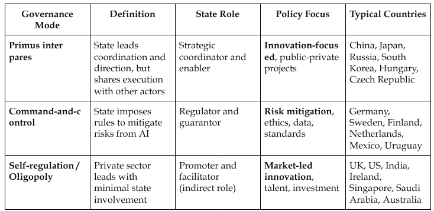

<figure-caption>

The state’s role in governing artificial intelligence: development, control, and promotion through national strategies ([Papyshev et al., 2023](https://www.researchgate.net/publication/367010605_The_state's_role_in_governing_artificial_intelligence_development_control_and_promotion_through_national_strategies)).

</figure-caption>

<figure-caption>

([State of AI Report, 2023](https://www.stateof.ai/))

</figure-caption>

## International Governance

<quote>

<speaker> António Guterres

<position> UN Secretary-General

<date>

<source>

<content>

AI poses a long-term global risk. Even its own designers have no idea where their breakthrough may lead. I urge [the UN Security Council] to approach this technology with a sense of urgency [...] Its creators themselves have warned that much bigger, potentially catastrophic and existential risks lie ahead.

</content>

</quote>

<quote>

<speaker> Kamala Harris

<position> Former US Vice President

<date>

<source>

<content>

[...] just as AI has the potential to do profound good, it also has the potential to cause profound harm. From AI-enabled cyberattacks at a scale beyond anything we have seen before to AI-formulated bio-weapons that could endanger the lives of millions, these threats are often referred to as the "existential threats of AI" because, of course, they could endanger the very existence of humanity. These threats, without question, are profound, and they demand global action.

</content>

</quote>

**Can't individual countries just regulate AI within their own borders?** The short answer is: no, not effectively. Effective management of advanced AI systems requires coordination that transcends national borders. This stems from three fundamental problems ([Ho et al., 2023](https://www.ceris.be/wp-content/uploads/2024/03/International-Institutions-for-Advanced-AI-Robert-Trager.pdf#:~:text=International%20institutions%20may%20have%20an%20important%20role,to%20innovation%20and%20the%20spread%20of%20benefits.)):

- **No single country has exclusive control over AI development.** Even if one nation implements stringent regulations, developers in countries with looser standards could still create and deploy potentially dangerous AI systems affecting the entire world ([Hausenloy et al., 2023](https://arxiv.org/pdf/2310.09217)).

- **AI risks have a global impact.** The regulation of those risks requires international cooperation ([Tallberg et al., 2023](https://papers.ssrn.com/sol3/papers.cfm?abstract_id=4424123)). When asked about China's participation in the Bletchley AI Safety summit, James Cleverly, former UK Foreign Secretary correctly noted: "we cannot keep the UK public safe from the risks of AI if we exclude one of the leading nations in AI tech."

- **Race-to-the-bottom dynamics.** Countries fear competitive disadvantage in the AI race, which creates incentives for regulatory arbitrage and undermines safety standards globally ([Lancieri et al., 2024](https://scholarship.law.georgetown.edu/facpub/2647/)). International governance can help align incentives between nations, encouraging responsible AI development without forcing any one country to sacrifice its competitive edge ([Li, 2025](https://digitalcommons.law.villanova.edu/cgi/viewcontent.cgi?article=3670&context=vlr)).

<iframe-static-figure>

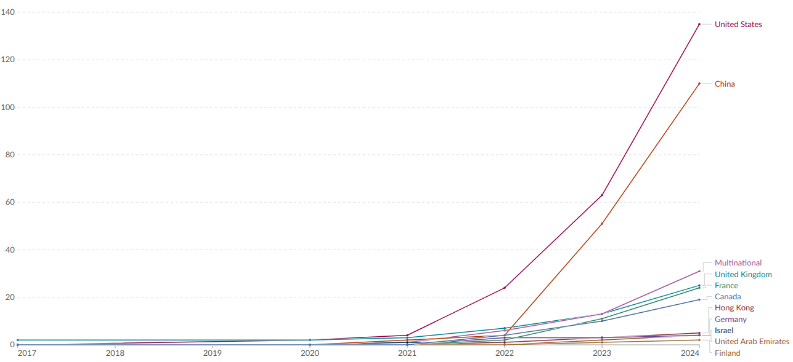

</iframe-static-figure>

<iframe src="https://ourworldindata.org/grapher/cumulative-number-of-large-scale-ai-systems-by-country?tab=chart" loading="lazy" style="width: 100%; height: 600px; border: 0px none;" allow="web-share; clipboard-write"></iframe>

<iframe-caption>

Cumulative number of large-scale AI systems by country since 2017. Refers to the location of the primary organization with which the authors of a large-scale AI systems are affiliated ([Giattino et al., 2023](https://ourworldindata.org/artificial-intelligence)).

</iframe-caption>

**How do national policies affect global AI development?** Even seemingly domestic regulations (such as immigration policies, see below) can reshape the global AI landscape through various spillover mechanisms.

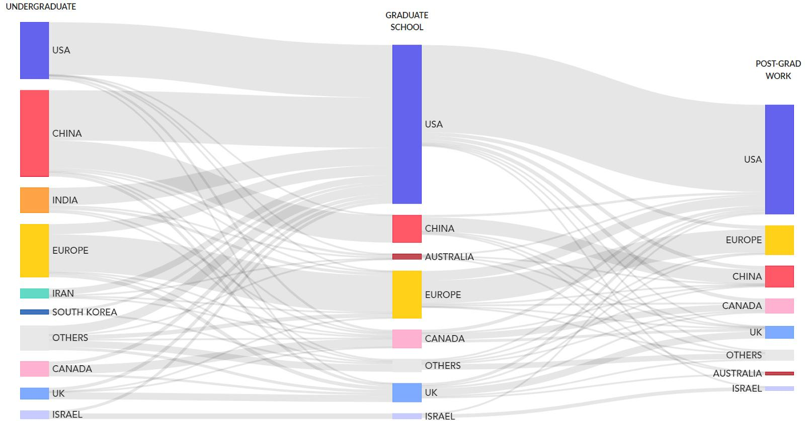

<figure-caption>

What are the career paths of top-tier AI researchers? ([MacroPolo](https://macropolo.org/digital-projects/the-global-ai-talent-tracker/))

</figure-caption>

Companies worldwide, eager to maintain access to the lucrative European market, often find it more cost-effective to adopt EU standards across their entire operations rather than maintaining separate standards for different regions. For example, a U.S. tech company developing a new AI-powered facial recognition system for use in public spaces may see this system being classified as “high-risk” under the EU AI Act. This would subject it to strict requirements around data quality, documentation, human oversight, and more. Companies then have a choice to either develop two separate versions of your product, one for the EU market and one for everywhere else, or simply apply the EU standards globally. Many will be tempted to choose the second option, to minimize their cost of compliance. This is what's known as the “Brussels Effect” ([Bradford, 2020](https://scholarship.law.columbia.edu/books/232/)): EU regulations can end up shaping global markets, even in countries where those regulations don't formally apply.

The Brussels Effect can manifest in two ways:

- **De facto adoption:** Companies often voluntarily adopt EU standards globally to avoid the complexity and cost of maintaining different standards for different markets.

- **De jure influence:** Other countries frequently adopt regulations similar to the EU's, either to maintain regulatory alignment or because they view the EU's approach as a model worth emulating.

The EU's regulations might offer the first widely adopted and mandated operationalization of concepts like "risk management" or "systemic risk" in the context of frontier AI. As other countries grapple with how to regulate advanced AI systems, they may look to the EU's framework as a starting point ([Siegmann & Anderljung 2022](https://www.governance.ai/research-paper/brussels-effect-ai)).

<quote>

<speaker> Ursula von der Leyen

<position> Head of EU Executive Branch

<date>

<source>

<content>

[We] should not underestimate the real threats coming from AI [...] It is moving faster than even its developers anticipated [...] We have a narrowing window of opportunity to guide this technology responsibly.

</content>

</quote>

In 2023, the US and UK governments both announced new institutes for AI safety. As of 2025, there are at least 12 national AI Safety Institutes (AISIs) established worldwide. These include institutes from the United States, United Kingdom, Canada, France, Germany, Italy, Japan, South Korea, Singapore, Australia, Kenya, and India. The European Union has established the European AI Office, which functions similarly to national AISIs. These institutes collaborate through the International Network of AI Safety Institutes, launched in November 2024, to coordinate research, share best practices, and develop interoperable safety standards for advanced AI systems.

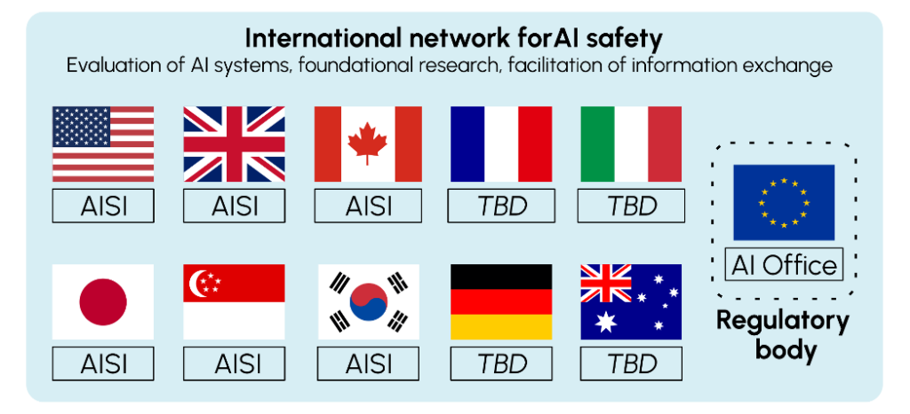

<figure-caption>

These countries are part of the international network for AI safety, with their respective national bodies dedicated to AI safety ([Variengien & Martinet, 2024](https://oecd.ai/en/wonk/ai-safety-institutes-challenge)).

</figure-caption>

**Global governance efforts also face major obstacles.** Strategic competition between leading powers, who view AI as both a national security asset and an economic engine, often undermines cooperation. Power asymmetries further complicate negotiations: countries with advanced AI capabilities, like the United States and China, may resist international constraints, while others may demand technology transfer and capacity-building support in exchange for participation. Divergent political systems and values also pose barriers, with disagreements over issues such as privacy, free expression, and state authority. For example, China’s Global AI Governance Initiative centers sovereignty and non-interference, contrasting with Western frameworks rooted in individual rights and democratic accountability ([Hung, 2025](https://www.researchgate.net/publication/387730260_Exploring_China's_cyber_sovereignty_concept_and_artificial_intelligence_governance_model_a_machine_learning_approach); [Hsu et al., 2023](https://www.cartercenter.org/resources/pdfs/peace/china/finding-firmer-ground-the-role-of-high-technology-in-u.s.-china-relations.pdf)). Perhaps most significantly, deep trust deficits between major powers, fueled by tensions over trade, intellectual property, and human rights, make it difficult to reach credible, enforceable agreements, adding to the complex geopolitical landscape shaping the future of international AI governance ([Mishra, 2024](https://www.techpolicy.press/from-competition-to-cooperation-can-uschina-engagement-overcome-geopolitical-barriers-in-ai-governance/)).

<figure-caption>

Cartoon highlighting a discrepancy between countries’ statements and their true intentions in the context of the U.K.’s november 2023 AI Safety Summit ([The Economist](https://www.economist.com/the-world-this-week/2023/11/02/kals-cartoon))

</figure-caption>

<note-box>

<collapsed> True

<title> Existing International Mechanisms (2025)

<content>

Despite these challenges, a patchwork of international initiatives has emerged to address AI governance:

- **The series of Global AI Summits:** Launched by the UK in 2023, the summits have been a platform for major stakeholders across the AI ecosystem to come together and discuss global priorities for AI safety, innovation, and governance. They continue to occur biannually, with a different country hosting each summit.

- **The Hiroshima AI Process:** Launched by the G7 nations, this initiative aims to promote responsible AI development and use through coordinated policies.

- **United Nations efforts:** Includes UNESCO’s AI ethics recommendations, the High-Level Advisory Body, and the upcoming Global Digital Compact, a United Nations framework for international digital cooperation, focused on a common digital future with an AI component.

- **OECD guidelines:** The Organisation for Economic Co-operation and Development has been particularly influential in shaping AI governance principles that inform national policies, and continues to guide regional frameworks with a focus on rights, transparency, and accountability.

- **Council of Europe AI treaty:** This proposed treaty aims to protect human rights in the context of AI development and use, focusing on ethical boundaries.

- **China's Global AI Governance Initiative:** Demonstrating that AI governance is a priority even for nations often at odds with Western powers, China has put forth its own proposal for international AI governance.

</content>

</note-box>

**How does international technology governance typically evolve?** Understanding the progression of international policymaking helps contextualize current AI governance efforts and identify potential paths forward. International policymaking typically progresses through several stages ([Badie et al., 2011](https://sk.sagepub.com/ency/edvol/intlpoliticalscience/chpt/stages-model-policy-making)):

- **Agenda setting:** Identifying the issue and placing it on the international agenda.

- **Policy formulation:** Developing potential solutions and approaches.

- **Decision making:** Choosing specific courses of action.

- **Implementation:** Putting chosen policies into practice.

- **Evaluation:** Assessing effectiveness and making adjustments.

For AI governance, we’re still largely in the early stages of this process. The Series of AI Summits, the Network of AI Safety Institutes, and other international frameworks all represent progress in agenda setting and initial policy formulation. But the real work of crafting binding international agreements and implementing them still lies ahead.

**Previous international governance efforts provide valuable lessons for AI.** So, what can we learn from decades of nuclear arms control efforts? Let's consider three important lessons ([Maas, 2019](https://www.tandfonline.com/doi/abs/10.1080/13523260.2019.1576464)):

- **The power of norms and institutions.** Despite early fears of rapid proliferation, only nine countries possess nuclear weapons nearly 80 years after their development which resulted from concerted efforts to build global norms against nuclear proliferation and use. The Nuclear Non-Proliferation Treaty (NPT), signed in 1968, created a framework for preventing the spread of nuclear weapons and helped promote peaceful uses of nuclear technology.

- **The role of epistemic communities.** The development of nuclear arms control agreements wasn't solely the work of diplomats and politicians. It relied heavily on input from scientists, engineers, and other technical experts who understood the technology and its implications. These experts formed a network of professionals with recognized expertise in a particular domain, or as what political scientists call an "epistemic community". They played important roles in shaping policy debates, providing technical advice, and even serving as back-channel diplomats during tense periods of the Cold War. Unlike nuclear physicists, who were often employed directly by governments, many AI experts work in the private sector, so a challenge to forming such networks for global AI governance will be ensuring that epistemic communities can effectively inform policy decisions.

- **The persistent challenge of "normal accidents."** Despite decades of careful management, the nuclear age has seen several incidents where human error, technical malfunctions, or misunderstandings nearly led to catastrophe. Sociologist Charles Perrow termed these "normal accidents," arguing that in complex, tightly-coupled systems, such incidents are inevitable ([1985](https://doi.org/10.5465/amr.1985.4278477)). Applying the concept to AI, we could see unexpected interactions and cascading failures increase as AI systems become more complex and interconnected. The speed at which AI systems operate could mean that a "normal accident" in AI might unfold too quickly for human intervention, challenging the notion of "meaningful human control," often proposed as a safeguard for AI systems ([Maas, 2019](https://www.tandfonline.com/doi/abs/10.1080/13523260.2019.1576464)).

#### Policy Options

<quote>

<speaker> Demis Hassabis

<position> Co-Founder and CEO of DeepMind

<date>

<source>

<content>

We must take the risks of AI as seriously as other major global challenges, like climate change. It took the international community too long to coordinate an effective global response to this, and we're living with the consequences of that now. We can't afford the same delay with AI [...] then maybe there's some kind of equivalent one day of the IAEA, which actually audits these things.

</content>

</quote>

Several institutional arrangements could support international AI governance ([Maas & Villalobos, 2024](https://papers.ssrn.com/sol3/papers.cfm?abstract_id=4579773)):

- **Scientific Consensus-Building:** Similar to the Intergovernmental Panel on Climate Change (IPCC), a dedicated body could provide regular reports on AI capabilities and risks to inform policymakers and the public. Given the rapid pace of AI development, this body would need to be nimbler than traditional scientific consensus-building organizations.

- **Political Consensus-Building and Norm-Setting:** Building on scientific consensus, a forum for political leaders could develop shared norms and principles, perhaps structured like the UN Framework Convention on Climate Change (UNFCCC). Such a body could facilitate ongoing dialogue, negotiate agreements, and adapt governance approaches as the technology evolves.

- **Coordination of Policy and Regulation:** An international body focused on policy coordination could help harmonize AI regulations across countries, reducing fragmentation and preventing regulatory arbitrage opportunities.

- **Enforcement of Standards and Restrictions:** Mechanisms for monitoring compliance and enforcing agreed-upon standards would be necessary for effective governance.

- **Stabilization and Emergency Response:** A global network of companies, experts, and regulators ready to assist with major AI system failures could help mitigate risks. This group could work proactively to identify potential vulnerabilities in global AI infrastructure and develop contingency plans, similar to the International Atomic Energy Agency's Incident and Emergency Centre but operating on much faster timescales.

- **International Joint Research:** Collaborative research could help ensure that frontier AI development prioritizes safety and beneficial outcomes, similar to how CERN facilitates international scientific cooperation.

- **Distribution of Benefits and Access:** An institution focused on ensuring equitable access to AI benefits could prevent harmful concentration of capabilities and ensure the technology's benefits are widely distributed through mechanisms like a global fund for AI development assistance or technology transfers.

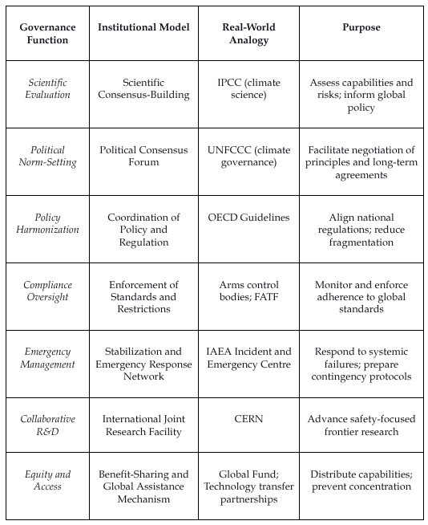

<figure-caption>

An overview table of governance functions and their purpose.

</figure-caption>

**What does this mean for designing effective institutions?** There is no one-size-fits-all solution. Institutions for global AI governance must be tailored to the unique characteristics of the technology: rapid iteration cycles, broad deployment contexts, and uncertain future trajectories. We will likely need a network of complementary institutions, each fulfilling specific governance functions listed above. The key is not just which institutions we build, but why and how. What specific risks and benefits require international coordination? What functions are essential to manage them? And which designs best match those functions under real-world constraints? Without clear answers, institutional design risks becoming a mirror of past regimes rather than a response to the challenges of advanced AI ([DeepMind, 2024](https://deepmind.google/discover/blog/exploring-institutions-for-global-ai-governance/)).