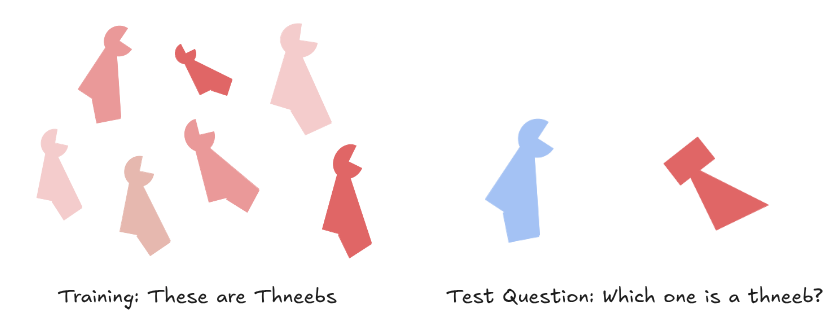
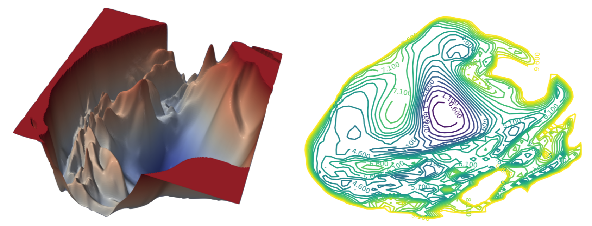
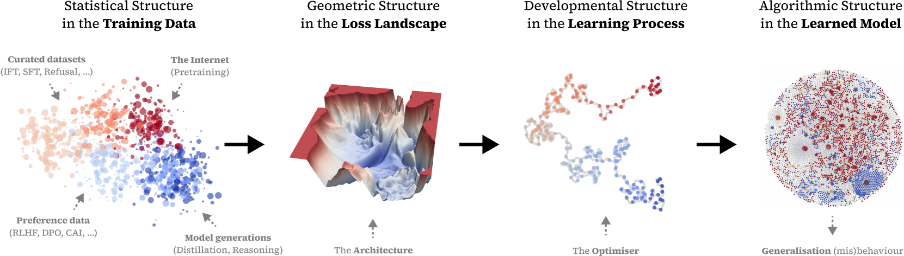
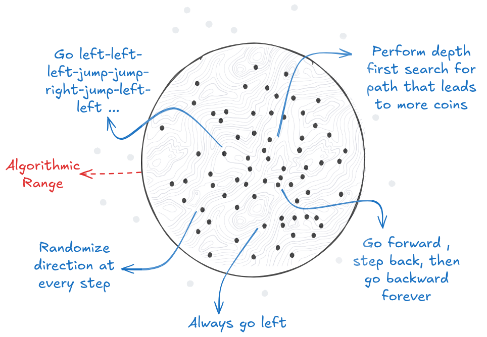
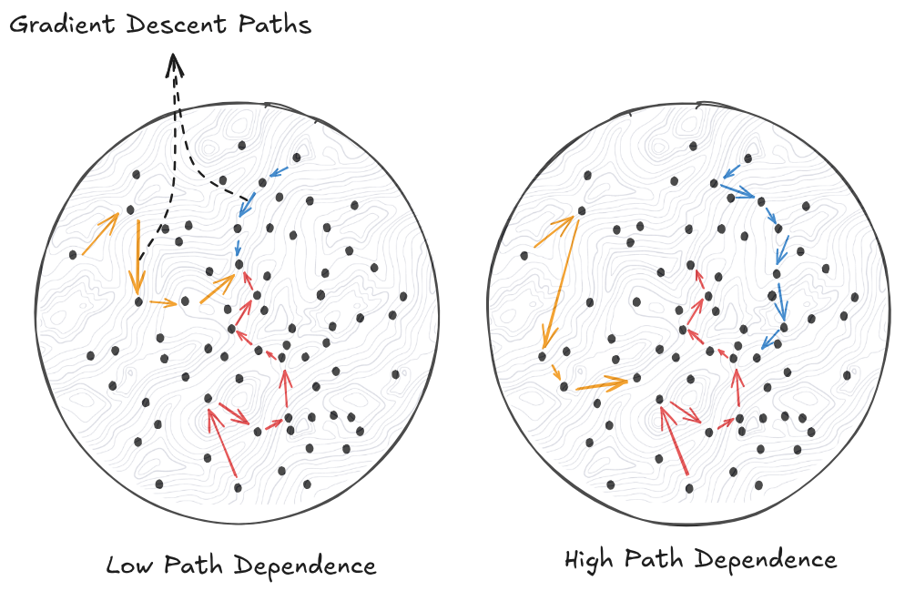

# Learning Dynamics

**A deeper understanding of goal misgeneralization requires examining how the training process in machine learning actually works.** When we train neural networks, we're adjusting millions or billions of parameters. But what do these parameters represent? The best way to think about machine learning is as a search process through a vast space of possible algorithms (also sometimes called search through the hypothesis space or model space). Each specific combination of parameter values corresponds to a different algorithm for processing information and making decisions. The path this search takes—and the biases that guide it—determine what types of algorithms get discovered and whether they pursue intended goals or merely correlated proxies. The intuitions that you learn in this section will help you immensely both in this chapter, but also in the later chapters on interpretability.

**Each point in parameter space encodes a complete algorithm.** Just as the binary digits 0 and 1 can encode any computer program, the millions of floating-point parameters in a neural network encode an algorithm for solving tasks. Change some parameters, and you get a different algorithm. The network's weights determine exactly how it processes inputs—what patterns it recognizes, what features it prioritizes, what decisions it makes. Two networks with different parameter values implement fundamentally different algorithms, even if they achieve similar performance.

**Training often discovers algorithms that work for unexpected reasons.** In the image below, if you show a human these red curved objects and say they were all "thneebs," most people would assume the defining feature is the shape. But if we use neural networks on similar examples, the networks would consistently learn that "thneeb" only means any "red object"—focusing on color rather than shape. Which is to say that if we gave them a blue object but with the same shape, then they don't consider it a “thneeb”. Both approaches achieve perfect performance during training, yet they represent completely different algorithms that would behave very differently when encountering new examples ([Cotra, 2021](https://www.cold-takes.com/why-ai-alignment-could-be-hard-with-modern-deep-learning/)).

<figure-caption>

This is called a Thneeb. It is a word defined only for the sake of the experiment. The image on the left is the training data, the image on the right is the test data. If after looking at the image on the left, we ask you which one of the two on the right is a thneeb? You would probably say the left object because you generalized through the shape path, but neural networks would answer that the shape on the right is a thneeb, showing they “prefer“ the color path ([Cotra, 2021](https://www.cold-takes.com/why-ai-alignment-could-be-hard-with-modern-deep-learning/); [Geirhos et al., 2019](https://arxiv.org/abs/1811.12231)).

</figure-caption>

**Many algorithms can be behaviorally indistinguishable during training while pursuing completely different goals.** We already made this point in the previous section but it is worth highlighting again. As another concrete example, researchers trained 100 identical BERT models on the same dataset with identical hyperparameters; all models achieved nearly indistinguishable performance during training. Yet when tested on novel sentence structures, these models revealed completely different approaches—some had learned more robust syntactic reasoning while others relied on superficial pattern matching. The training process had found 100 different algorithms in the space of possible language processing strategies ([McCoy et al., 2019](https://arxiv.org/abs/1911.02969)).

The reason we make this point again is to motivate the fact that understanding the search process—how training navigates the space of possible algorithms and which solutions it tends to discover. This is very useful for what types of AIs (parameter configurations = algorithms) we might actually end up discovering, and whether we can change something about our architectures or learning dynamics to influence this process.

## Loss Landscapes

<video>

[https://www.youtube.com/watch?v=NrO20Jb-hy0](null)

</video>

<video-caption>

Optional video explaining loss landscapes.

</video-caption>

**Loss landscapes explain why training can discover multiple algorithmic solutions to the same task, each pursuing different goals.** When we visualize how neural network performance changes across parameter configurations, we create what researchers call a "loss landscape." Each point in this high-dimensional space represents a different algorithm, with "height" indicating how poorly that algorithm performs on the specification (higher loss means worse performance). This landscape concept applies regardless of how we specify the task—whether through reward functions, human feedback, or any other performance measure.

<definition>

<term>Loss Landscape

<source> ([Li et al., 2017](https://arxiv.org/abs/1712.09913))

<content>

A loss landscape is a visualization of how the loss (performance) of a neural network changes as we vary its parameters. Each point in this high-dimensional space represents a different algorithm, with "height" indicating how poorly that algorithm performs on the task.

</content>

</definition>

<figure-caption>

This is the loss landscape of ResNet-110-noshort, in both 3D (left) and 2D (right). The paths that SGD takes through these different loss landscapes will be different ([Li et al., 2017](https://arxiv.org/abs/1712.09913)).

</figure-caption>

**The loss landscape itself remains identical across different training runs—only the starting position changes.** Think of this landscape as a fixed mountain range with peaks, valleys, ridges, and basins. This terrain is completely determined by your network architecture (the geological structure), your training data (the climate that shaped it), and your loss function (the elevation measurement system). Every time you train the same architecture on the same data, you're exploring the exact same mountain range. The peaks and valleys never move. What changes is where you start: random initialization is like being blindfolded and dropped at a random location in this mountain range. From each starting point, gradient descent acts like a ball rolling downhill, following the steepest descent toward the nearest valley bottom.

**The geometry of these landscapes determines which algorithms are discoverable and robust.** Some algorithmic solutions occupy wide, flat valleys where many parameter settings implement similar approaches. Others exist as sharp, narrow peaks that are difficult to find, easy to lose and often misgeneralize under distribution shifts. Algorithms in wide basins remain stable when their parameters are slightly perturbed, corresponding to robust, generalizable solutions ([Li et al., 2017](https://arxiv.org/abs/1712.09913)). Sharp peaks represent brittle algorithms where tiny changes can cause major performance drops ([Keskar et al.; 2017](https://arxiv.org/abs/1609.04836)). This geometry matters for goal misgeneralization because the width of different goal-valleys determines their discoverability—wider valleys for misaligned goals make those goals more likely to emerge from training.

<figure-caption>

From data to model behaviour: Structure in data determines internal structure in models and thus generalisation. Current approaches to alignment work by shaping the training distribution (left), which only indirectly determines model structure (right) through the effects on shaping the optimisation process (middle left & right). To mitigate the limitations of this indirect approach, alignment requires a better understanding of these intermediate links ([Lehalleur et al., 2025](https://arxiv.org/abs/2502.05475))

</figure-caption>

**Understanding landscape structure reveals why certain goals systematically emerge over others.** The relative size and accessibility of different valleys creates systematic biases in what gets discovered. If the "move right" valley is wider and easier to reach than the "collect coins" valley, training will more often discover the misaligned solution. This landscape structure is determined by the network architecture, training data, and loss function—but most importantly, by the inductive biases that shape which types of algorithms get wide valleys versus narrow peaks.

<definition>

<term>Algorithmic Range

<source>

<content>

The algorithmic range of a machine learning system refers to how extensive the set of algorithms capable of being found is.

</content>

</definition>

<figure-caption>

A 2D loss landscape where each dot represents a learned algorithm with a different set of parameters on the landscape. There are various different algorithms that the model can learn from the CoinRun example. The goal of SGD is to search through this space for the right dot (set of parameters = learned algorithm).

</figure-caption>

## Path Dependence

**Path dependence determines whether different starting points in the loss landscape lead to the same algorithmic destination.** In simple landscapes with one dominant valley, almost every starting point rolls into the same solution—that's low path dependence. But complex landscapes contain multiple deep valleys separated by ridges. Now your starting position matters enormously. Drop the ball on the left side of a ridge, and it rolls into Valley A (learning to "move right" in CoinRun). Drop it on the right side, and it rolls into Valley B (learning to "collect coins"). Both valleys represent perfect solutions during training, but they implement completely different algorithms.

<definition>

<term> Path Dependence

<source>

<content>

Path dependence occurs when small differences in the training process lead to discovering fundamentally different algorithms for solving the same task. High path dependence means high variance in learned algorithms across training runs, while low path dependence means consistently finding similar algorithmic solutions.

</content>

</definition>

**Path dependence emerges from how gradient descent navigates the loss landscape.** Training begins from a random point in parameter space and follows the steepest downhill path toward better performance. When multiple valleys exist—each corresponding to different algorithmic approaches—early random differences can push optimization toward completely different regions. Once committed to descending into a particular valley, gradient descent tends to continue in that direction, making it difficult to escape to other algorithmic solutions.

**High path dependence appears when identical training setups discover fundamentally different algorithmic strategies.** Researchers trained text classifiers on natural language inference tasks and found that models with identical training performance fell into distinct clusters. Models within each cluster used similar reasoning approaches and could be connected through the loss landscape, but models from different clusters were separated by large performance barriers. One cluster learned bag-of-words approaches while another developed syntactic reasoning strategies ([Juneja et al., 2023](https://arxiv.org/abs/2205.12411)). Similar variance appears across reinforcement learning experiments and fine-tuning studies where identical setups produce dramatically different learned behaviors.

**Low path dependence emerges when mathematical constraints force convergence to the same solution.** Delayed generalization, is a phenomenon where a model abruptly transitions from overfitting (performing well only on training data) to generalizing (also called "grokking") ([Carvalho et al., 2025](https://arxiv.org/abs/2502.01774v1)). As an example, models learning arithmetic initially memorize training examples and perform poorly on tests. But extended training causes them to suddenly implement the correct mathematical algorithm—consistently the same one across different runs. This suggests that for some tasks, the underlying mathematical structure constrains the solution space so severely that only one good algorithm exists ([Mingard et al., 2019](https://towardsdatascience.com/neural-networks-are-fundamentally-bayesian-bee9a172fad8/)). Other evidence includes studies showing gradient descent outcomes correlate with random sampling from parameter distributions.

<figure-caption>

A 2D loss landscape where each dot represents a learned algorithm with a different set of parameters on the landscape. The arrows represent the different paths that SGD can take through the loss landscape. If different starting points end up at the same learned algorithm, then we have low path dependence (left), else if different starting points result in different learned algorithms then we have high path dependance (right). </figure-caption>

## Inductive Bias

**Inductive biases describe the shape of the landscape and determine which types of algorithms are more likely to be discovered.** If your architecture has a simplicity inductive bias, then this means that algorithmically simple solutions are wide, deep valleys that dominate the loss landscape. Complex solutions might still exist in the landscape, but they're relegated to tiny, hard-to-find peaks. This intuitively explains why the "move right" strategy in CoinRun occupies a massive loss basin spanning huge regions of parameter space, while "navigate to coin-shaped objects" exists only in smaller pockets. You are more likely to find simpler solutions like move right because those basins and valleys are just easier to find and fall into.

<definition>

<term>Inductive Bias

<source>

<content> Inductive biases are systematic preferences of learning algorithms that favor certain types of solutions over others. These biases emerge from the architecture, optimization procedure, and training setup rather than being explicitly programmed.

</content>

</definition>

**Simplicity bias represents the most influential, well studied and potentiallydangerousinductive bias for goal misgeneralization.** The simplicity bias asks "how complex is it to specify the algorithm in the weights?" This is the ML equivalent of Occam's Razor, which suggests that among competing hypotheses, the one with the fewest assumptions should be selected. SGD seems to subscribe to Occam's Razor, and consistently favors algorithms that rely on simple correlations over complex causal reasoning ([Shah et al., 2020](https://arxiv.org/abs/2006.07710); [Ren & Sutherland, 2024](https://arxiv.org/abs/2409.09626); [Etienne & Flammarion, 2025](https://arxiv.org/abs/2410.02348); [Tsoy & Konstantinov, 2024](https://arxiv.org/abs/2405.17299); [Carlsmith, 2023](https://arxiv.org/abs/2311.08379))[^footnote_simplicity_bias]. In CoinRun, both "move right" and "navigate to coin-shaped objects" could solve the task during training, but "move right" is algorithmically simpler—requiring a single behavioral pattern rather than object recognition, spatial reasoning, and goal-directed navigation. So, the bias exists because simple functions occupy vastly larger volumes in the loss landscape - there are just a lot more ways to encode "move right" than "navigate to coin-shaped objects using visual recognition and spatial reasoning." Empirical work demonstrates that this bias is quite strong, suggesting simple functions are exponentially more likely to emerge than complex ones. ([Valle-Pérez et al., 2019](https://arxiv.org/abs/1805.08522)). The training process systematically favors the simpler explanation, even when the complex algorithm would generalize better ([Valle-Pérez et al., 2019](https://arxiv.org/abs/1805.08522); [Shah et al., 2020](https://arxiv.org/abs/2006.07710)). This pattern extends broadly to different architectures: image classifiers typically learn texture-based strategies over shape-based ones because texture patterns require simpler computational structures, leading to brittleness when texture and shape provide conflicting signals ([Geirhos et al., 2019](https://arxiv.org/abs/1811.12231)).

[^footnote_simplicity_bias]: More resources to learn about simplicity bias at this link -

[Github - Simplicity Bias Papers](https://github.com/sadimanna/simplicity-bias-papers)

**Other inductive biases can create additional systematic preferences that can favor discovering algorithms with misaligned goals.** Speed bias looks at "how much computation does the algorithm take at inference time?". An architecture with a speed bias would have wider loss basins with algorithms requiring fewer computational steps, potentially conflicting with solutions that perform more thorough reasoning or long term planning. There are many other examples of biases - frequency bias (learning low-frequency patterns before high-frequency ones) ([Rahaman et al., 2019](https://arxiv.org/abs/1806.08734)), geometric bias (solutions with lower variability) ([Luo et al., 2019](https://arxiv.org/abs/2209.13083)), and more. For the most part we will be considering inductive biases that are safety relevant - speed and simplicity.

**Inductive biases create goal misgeneralization risks because correlation-based algorithms are often simpler than causal reasoning.** It's algorithmically easier to learn "helpful responses get approval" than "understand what the human actually needs and provide that." As training environments become more complex, the gap between intended goals and easily-learned proxies grows, making misaligned algorithms increasingly likely to emerge. The interaction between inductive biases and path dependence determines both the type and specific implementation of learned algorithms—biases constrain training to favor certain solution classes, while path dependence determines which specific implementation within that class gets discovered.

This section on learning dynamics and inductive biases will be especially relevant when we talk about the likelihood of scheming and deceptive alignment.